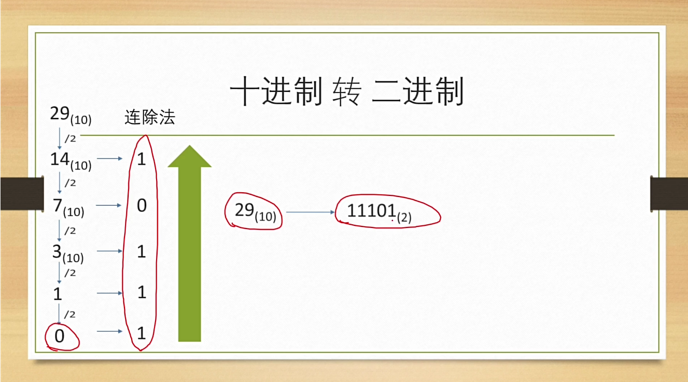

# 进制转换

## 各进制转十进制

首先在十进制中，每一位置可以有10个不同的数字

$(235)_{10}$

计算方法就是

$2 \times 10^2 + 3 \times 10^1 + 5 \times 10^0 = 200 + 30 + 5$

这里的底数10就是代表着十进制，指数就是位置。


同样对于其他的进制转十进制的计算方法也相似

如二进制：

$1011$

计算方法：

$1 \times 2^3 + 0 \times 2^2 + 1 \times 2^1 + 1 \times 2^0 = 8 + 2 + 1 = (11)_{10}$

则相对于十进制中的个位十位百位千位来说，二进制中为二位四位八位十六位等


八进制转十进制：

e.g. $(277)_8$

$2 \times 8^2 + 7 \times 8^1 + 7 \times 8^0 = 128 + 56 + 7 = 191$


当为十六进制时，注意符号为0~9 ~ A~F一共16个字符


## 十进制转各进制

连除法

e.g.十进制转二进制$(29)_{10} = (11101)_2$

计算方法为一直÷2，每除一次余下来的数就是0或者1，填充。



最后是从下往上填充，注意不要弄反了，下面的小数转换是从上到下填充。


# 小数进制转换

在整数的二进制转十进制过程中

例如：$(101)_2 = 1 \times 2^2 + 0 \times 2^1 + 1 \times 2^0 = 5$

在小数转进制中，可以将小数点左右分开来转换，整数部分还是像上面一样，小数部分对比于十进制÷10和÷100**变为除以进制数的次方**

e.g. $(101.11)_2 = 5 + \frac {1}{2^1} + \frac{1}{2^2} = (5.75)_{10}$


相反：

$(0.125)_{10} = 0.001 $ 

0.25 × 2 = 0

↓

0.5 × 2 = 0

↓

1.0 = 1


e.g.2

$(0.75)_{10} = 0.11$

1.5 × 2 = 1

1.0 × 2 = 1

每次×2只考虑小数部分不考虑整数部分。


## 关于科学计数法的转换

e.g. 光速$c = 0001 \ 0001 \ 1101 \ 1110 \ 1001 \ 0101 \ 1100 \ 0000_2$

转换为二进制的科学计数法为：

$c = 1.0001 \ 1101 \ 1110 \ 1001 \ 0101 \ 1100 \ 0000 \times 2^{28}$

总体上来说表达的方式还是可以参考十进制的，只不过对应进制也要改变底数，不要再一味地认为一位是十进制的，可能其他的进制会有不一样的大小。


## 8421BCD进制

8421BCD是一种二进制编码的十进制数字表示法，也称为8421二进制压缩十进制（BCD）。它将**每个十进制数字表示为一个4位的二进制数**。具体地说，8421BCD编码如下：

- 十进制数字0到9分别用四位二进制数的形式表示，从0000到1001。
- 这些数字的二进制表示与其对应的十进制数相同，即0到9。
- 8421BCD编码的末尾有时会补零，以使得每个数字都用4位二进制数表示。

因此，8421BCD是一种将十进制数字转换为二进制形式的编码方式，它在数字之间的转换和处理过程中保留了十进制的形式，便于数字的显示和处理。


e.g. $725_{10} = 0111 \ 0010 \ 0101_{8421BCD}$

1. 数字7的二进制表示为0111。
2. 数字2的二进制表示为0010。
3. 数字5的二进制表示为0101。

注意这个进制编码和普通的二进制编码还是存在区别的。


## 格雷码（Gray Code）

格雷码（Gray code）是一种二进制数字编码系统，**其中相邻的两个数字之间只有一个位数不同**。这种编码方式在数字表示中经常用于减少误码和电路设计中的抖动问题。

在格雷码中，任意两个相邻的数字之间只有一个位数不同。这种特性使得在数字之间进行切换时，只有一个位的变化，从而减少了切换过程中的电路抖动和误码的产生。格雷码的生成有多种方法，其中最常见的是递归方法。


好的，我们将以一个十进制数字转换为3位格雷码的示例来说明。

让我们尝试将十进制数5转换为3位格雷码。

**步骤1：** 首先，我们将十进制数字5转换为二进制数。

```
5的二进制数 = 101
```

**步骤2：** 然后，我们将二进制数转换为格雷码。**从左往右开始，第一位保持不变，接着每一位都与前一位==进行异或操作==，得到格雷码**。

- 第一位保持不变，所以格雷码的第一位是1。
- 对于第二位，1 XOR 0 = 1。
- 对于第三位，0 XOR 1 = 1。

因此，5的3位格雷码为111。

这就是将十进制数字5转换为3位格雷码的过程。


## 负数十进制转二进制

**主要的操作在于最后的取反并加1。**首先将负号忽视，按照正常流程转换成二进制

e.g. $(-5)_{10}$

首先假如说我们最后需要得到的是8位的二进制数，则先写出5的8位二进制补码写法：

$(5)_{10} = 0000 \ 0101$

其实本质上来说无论是8位二进制补码还是普通二进制，相差都不大，补码的意思仅仅是在前面添加0来凑齐4的整数倍位数，这个通常根据需要的储存大小（比如int long等）来决定。

之后，我们将二进制数取反，注意这里就会让不同的补码产生不同的结果，要注意读题。

$0000 \ 0101 → 1111 \ 1010$

然后再将取反后的结果加1 得到

$1111 1010 + 1 → 1111 \ 1011$

则$(-5)_{10} = 1111 \ 1011$


## 如何区分正数与负数编码？

通常来说，固定位数的补码表示法可以用来表示有符号整数（signed number）。常见的情况是使用8位、16位、32位或64位的补码来表示有符号整数，具体取决于应用的需求和计算机体系结构的设计。

其中，8位补码（即8位的二进制数）是一种常见的表示方法，尤其在早期的计算机系统中广泛使用。它提供了128个不同的数值，其中第一个位（最左侧的位）用于表示符号，而其他位用于表示数值。**如果最左侧的位为0，表示正数；如果最左侧的位为1，表示负数。**

然而，在现代计算机系统中，通常会使用更长的补码来表示有符号整数，比如16位、32位或64位。这些更长的补码提供了更大的数值范围，可以表示更大的整数值或者提供更高的精度。