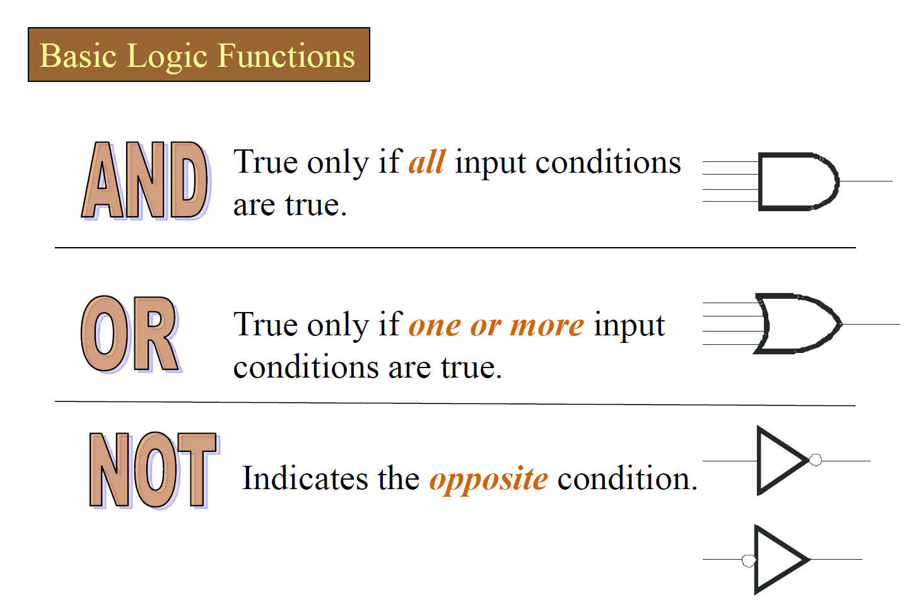
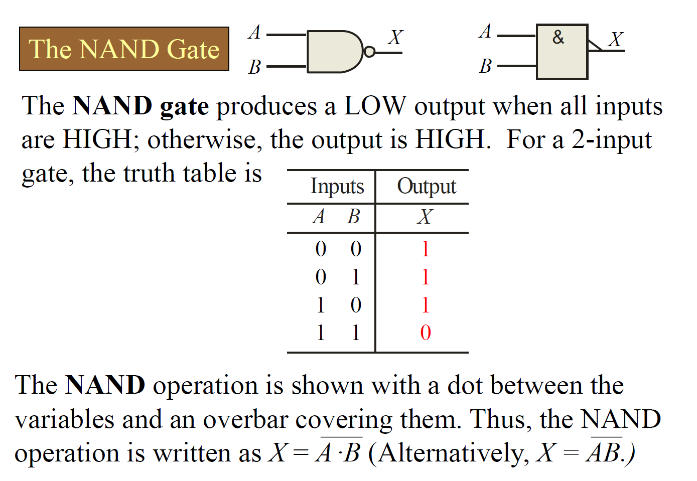
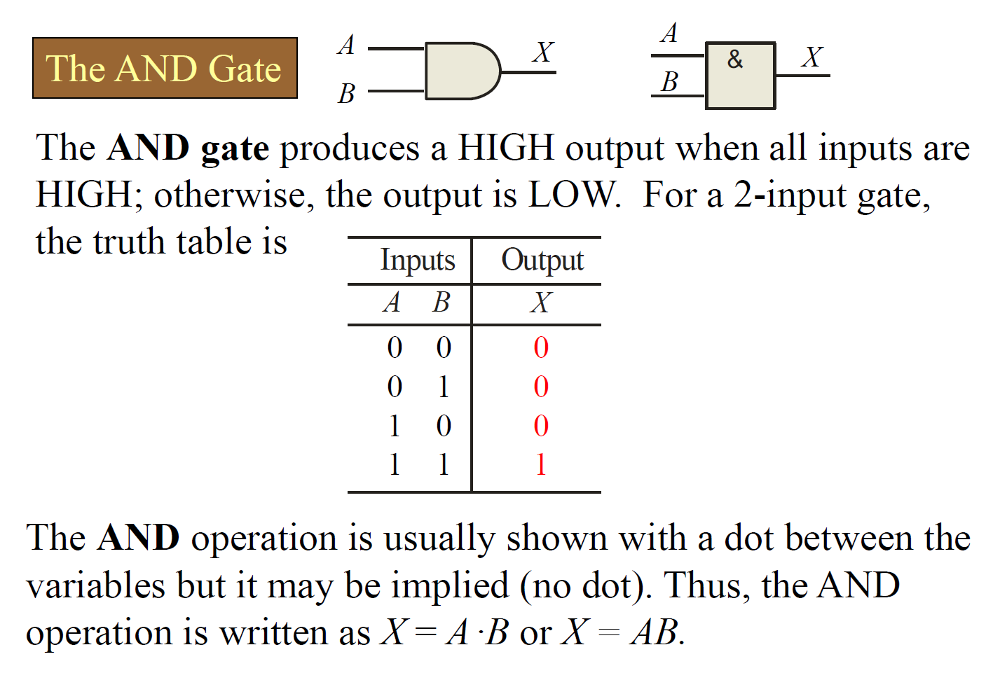
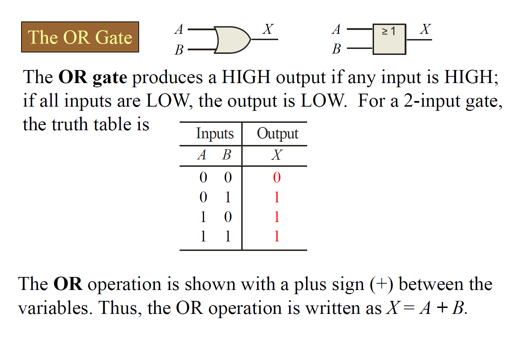
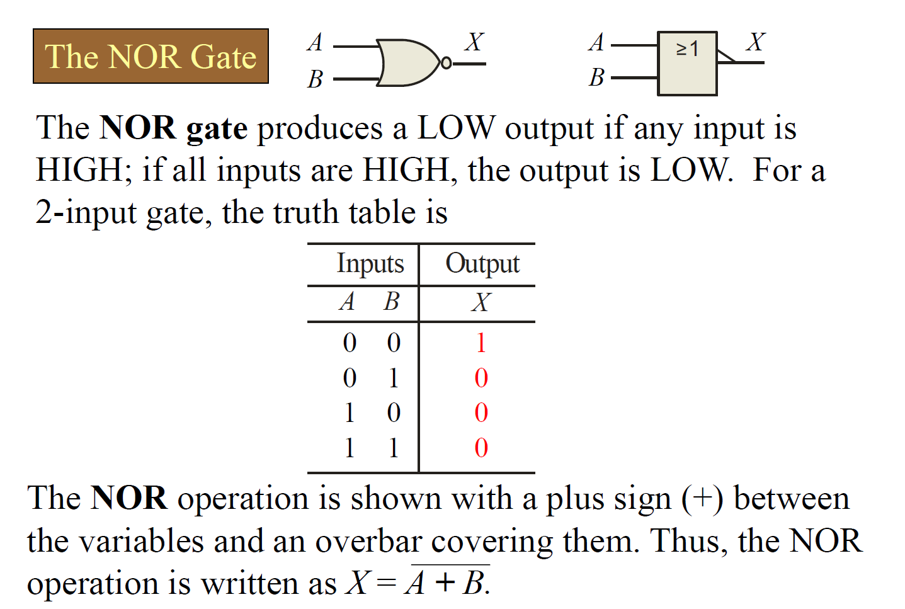
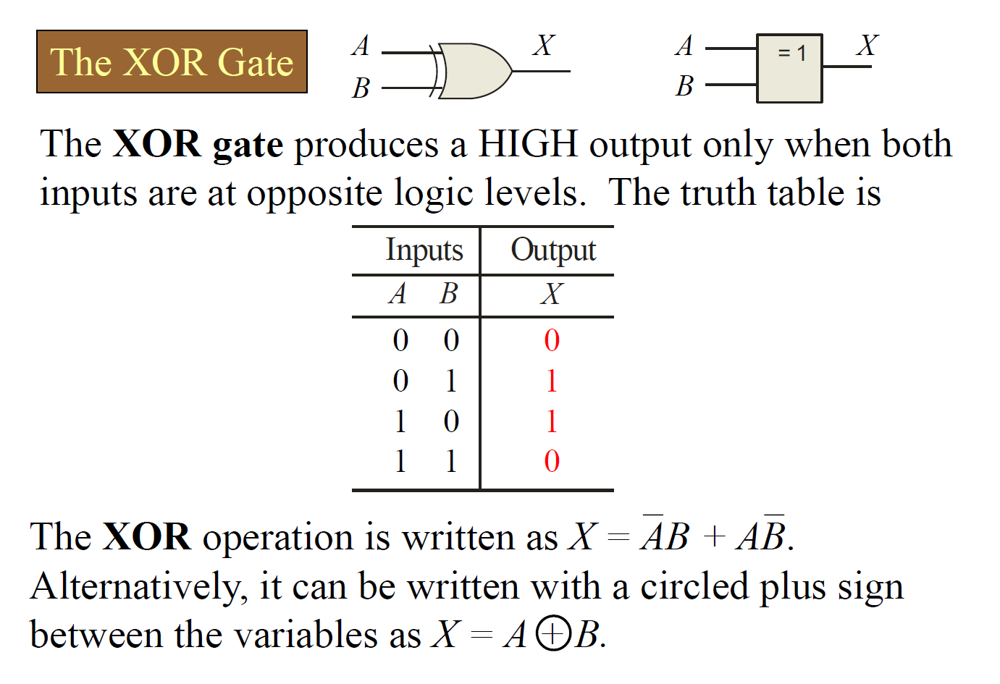
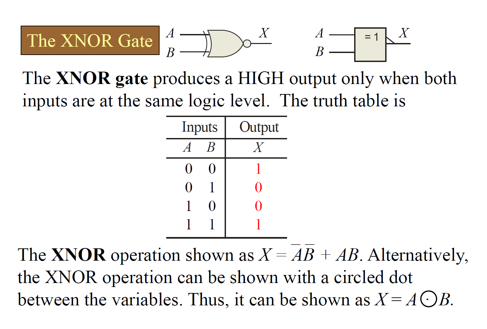
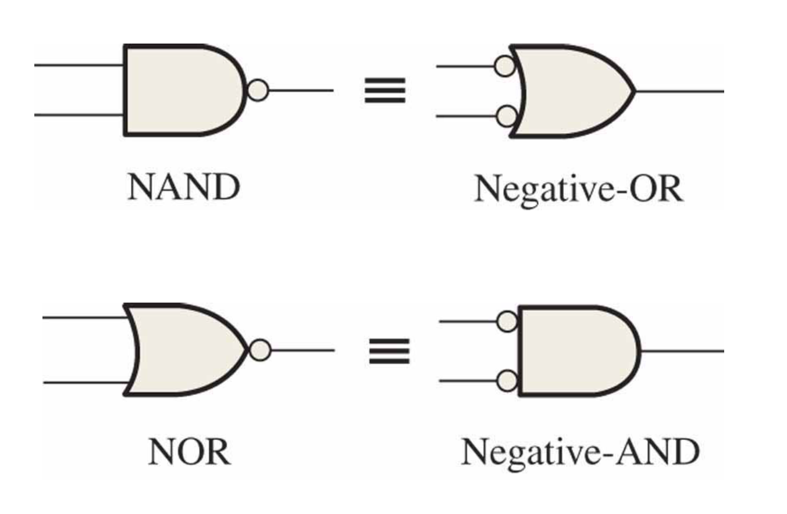

# 逻辑门

(1)基本概念

1）数字电路中晶体管作为开关使用时，是指它的工作状态处于饱和状态和截止状态。

2）TTL门电路典型高电平为3.6 V，典型低电平为0.3 V。

3）OC门和OD门具有**线与**功能。

4）三态门电路的**特点、逻辑功能和应用**。高阻态、高电平、低电平。

5）门电路参数：**噪声容限** **$V_{NH}$** **或** **$V_{NL}$** **、扇出系数** **$N_o$** **、平均传输时间** **$t_{pd}$**。

**要求：**掌握八种逻辑门电路的逻辑功能；掌握 **OC** **门和** **OD** **门**，**三态门电路的逻辑功能；能根据输入信号画出各种逻辑门电路的输出波形**。

==**AND Gate is for $A \cdot B$, OR Gate is for $A + B$.**==

注意关于那个小圆圈的位置，代表Negative，在输入端和输出端是有区别的

