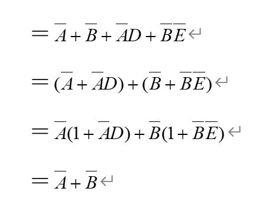
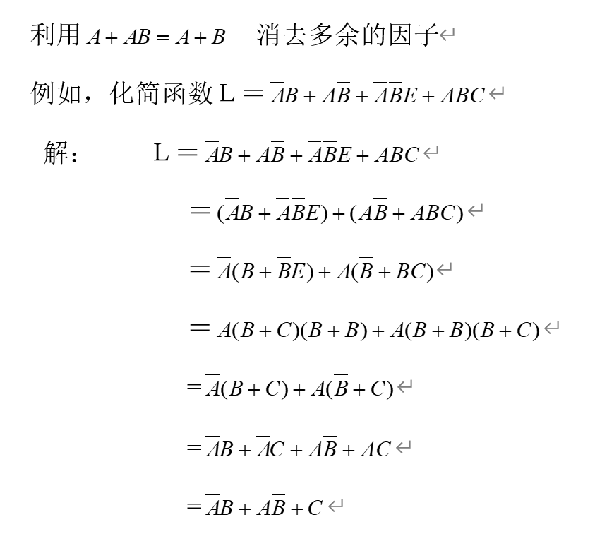
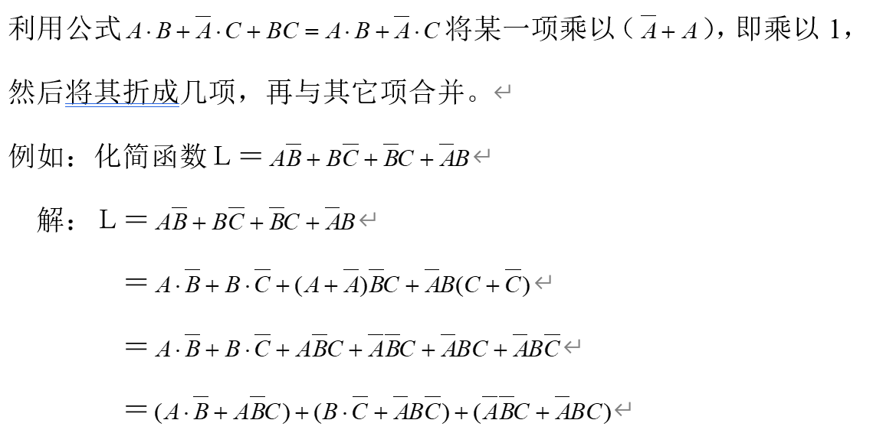
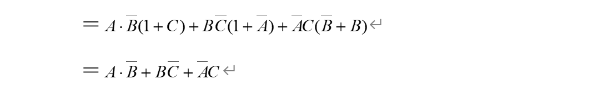
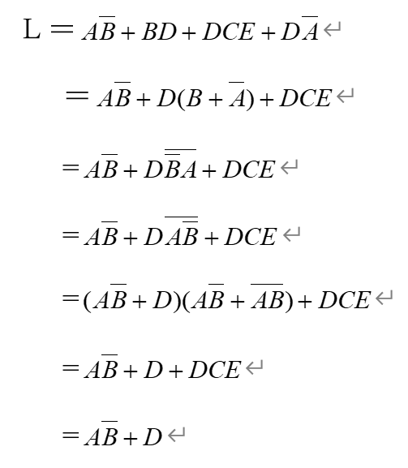
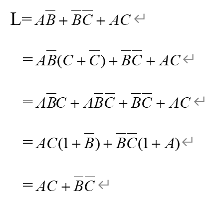
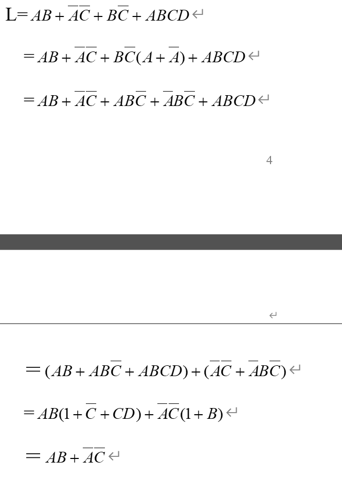

# 逻辑代数

## 1 常用公式/基本公式

常量与变量之间的关系

$A + 0 = A $

$A \cdot 1 = A$

$A + 1 = 1$

$A \cdot 0 = 0$

$A + \bar{A} = 1$

$A \cdot \bar{A} = 0$

## 2与普通代数像运算规律

a.交换律：Ａ+Ｂ＝Ｂ+Ａ　　

b.结合律：（Ａ+Ｂ）+Ｃ＝Ａ+（Ｂ+Ｃ）　

c.分配律：＝ 

　

## 3逻辑函数的特殊规律

a. 同一律：$A + A = A$

**b. 摩根定律：$\overline{A+B} = \bar{A} \cdot \bar{B}$**

**$\overline{A \cdot B} = \bar{A} + \bar{B}$**

c. 关于否定的性质 $A = \bar{\bar{A}}$

## 代入规则

在任何一个逻辑等式中，如果将等式两边同时出现某一变量Ａ的地方，都用一个函数Ｌ表示，则等式仍然成立，这个规则称为代入规则：

例如：$A \cdot \bar{B \oplus C} + \bar{A} \cdot B \oplus C$

可令 $L = B \oplus C$

则上式变成$A \cdot \bar{L} + \bar{A} \cdot L = A \oplus L = A \oplus B \oplus C$

## 公式化简法

1. 合并项法

利用 $A + \bar{A} = 1$或$A \cdot B + A \cdot \bar{B} = A $将两项合并成一项，从而消去一个变量

e.g. $L = \bar{A} \bar{B} \bar{C} + \bar{A} \bar{B} C = \bar{A} \bar{B} (C + \bar{C}) = \bar{A} \bar{B}$

2. 吸收法

利用公式$A + A \cdot B  = A$，消去多余的积项，根据代入规则$A \cdot B$可以是任何一个复杂的逻辑式

e.g. 化简函数$L = \bar{AB} +\bar{A} D + \bar{B} \bar{E}$

3. 消去法

4. 配项法

## example

