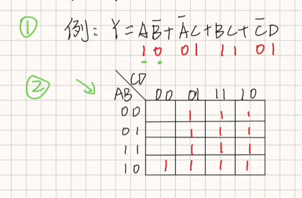
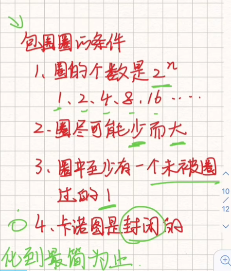
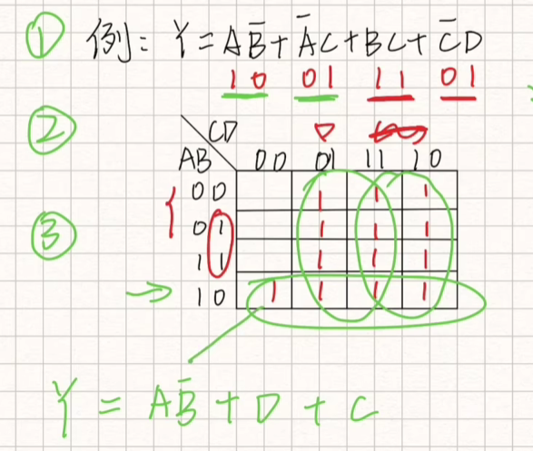
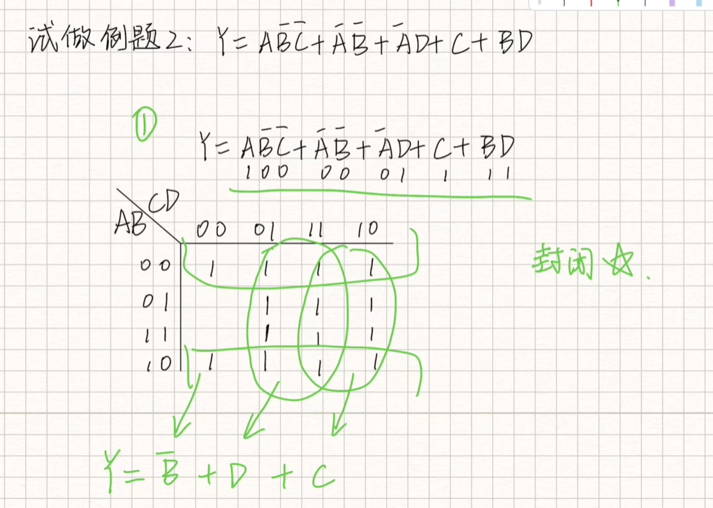

# 卡诺图

在有逻辑代数化简的时候，选择卡诺图化简

e.g. $Y = A \bar{B} + \bar{A}B + BC + \bar{C}D$

首先我们假设ABCD都是1，对于取反的数就是0，则原式可以变成：

注意卡诺图中第三位和第四位11和10的顺序跟正常的逻辑不一样，但是不可以改变。

之后在卡诺图中的相应区域画出含有该数字组合的区域，用1表示。

具体来说：

例如$A \bar{B}$，我们假设的是10，则在卡诺图中，看到左边那一列，找到对应10，也就是第一位是1，第二位是0，则对应的这一行都是要画1的。

对于$\bar{A} C$，其中A为0，C为1，在AB列中找到第一位为0的两行，之后看到CD行中C（第一位）为1的列，交集就是相应填1的位置。可见位于表格中右上角的四个框都要填1。

省略后续，我们得到上述的表格

之后对于表格中的1画圈，条件如下：

首先每次圈起来1的个数为2的指数次，比如一次圈8个，4个等等。

其次来说尽量用更少的圈来覆盖所有的1，这样才能保证化到最简。

对于最终的结果转换，是将每一个圈转换成一个相乘的项，有三个圈，则代表了最终就有三项。

首先对于最底部的圈，得到的结果是$A \bar{B}$；对于中间的圈，得到的结果是$D$；对于右边第三个圈得到的结果是C。

具体来说，就是在圈所代表的左侧或者上部ABCD的值来说，选定值固定的变量作为结果，但凡出现一个变量有两种可能性的时候，都不要带。

可见为什么最终只有三项？因为其中两个横圈可以化成$\bar{A} \bar{B}$和$A \bar{B}$

而$\bar{A} \bar{B} + A \bar{B} $又可以继续化简成$\bar {B}$

那么本质上来说是4个圈吗，并不是，其实上下两端是连接的，其实只有3个圈。

## 关于1或者2的补码

区别在于1的补码在取反过后不用加一，而2的补码在取反过后要加一。

e.g. 在1的补码下表达0有两种方式：当表示（+0）时为0，表示（-0）时为1.

更直观的理解为1的补码下相反数的二进制值相加为1，2的补码下相反数相加为0.

e.g. 在2的补码下表达0只有一种方式：0

e.g. 将-34转换为8位的1的补码形式：

34 = 00100010

$-34 = \bar{00100010} = 11011101$

这里转换不需要加一

e.g. 将-68转换为8位的2的补码形式：

68 = 01000100

$-68 = \bar{01000100} + 1= 10111011 + 1= 10111100$

# Express each of the following sign-magnitude binary numbers in single-precision floating­ point 
e.g. 0111110000101011转换为单精度浮点数：

0111110000101011首先观察符号位为0

则为正数，从第二位开始取，上述式子可以转换为：

$1.11110000101011 \times 2^{14}$

可以得到exponent = 127 + 14 = 141 = 10001101

其中127为初始值，需要记，14为原式转换成的2的指数，相加得141，转换为8位二进制补码得10001101，这个8位数也就是指数部分。

最后将三个部分组合并补齐到固定的32位即是最终答案。

首先是符号位，之后是exponent再是mantissa，最后补零。

0 10001101 11110000101011 000000000

==中间本身的部分，为什么是4个1而不是5个1？因为在尾数mantissa部分，不应该包括其最高位==

在例子上述例子中，原始的二进制数`111110000101011`被规范化为 $1.11110000101011×2^{14}$。去掉规范化后的二进制数中的最高位“1”之后，我们得到`11110000101011`作为开始的尾数部分。

e.g. 100110000011000转换为单精度浮点数

这里与上面的不同之处在于符号位变成了1.

则从第4位开始取，上述式子可以转换为：

$1.10000011000 \times 2^{11}$

注意这里最后的0不可以省略掉，就像是在十进制里面，后面的虽然为0但是位数是存在的。

可以得到exponent = 127 + 11 = 138 = 10001010

mantissa补位后得到：

1000001100000000000000

将三个部分相加后得到：

1 10001010 10000011000 000000000000

# 单精度逆变换

e.g. 将1 10000001 01001001110001000000000转换为单精度浮点数

Sign = 1

Exponent = 10000001 = 129

Exponent' = 129 - 127 = 2

Mantissa = $1.01001110001 \times 2^2 = 101.001001110001$

==这里参考正常转换时需要去掉最大位的1来看，这里也需要把1添加上到最大位。==

这里相当于是把原来的补位0去掉后用上面的exponent' 表达出其指数形式，之后转换成float

最后加上符号

$-101.001001110001 = -5.15258789$

e.g. 将0 11001100 10000111110100100000000转换为单精度浮点数

Sign = 0

Exponent = 11001100 = 204

Exponent' = 204 - 127 = 77

Mantissa = $1.100001111101001 \times 2^{77}$

最后数字太大不适宜表示。
