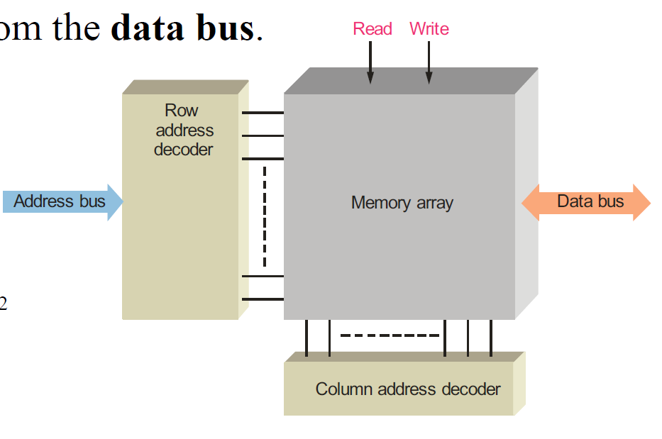

## 内存单位

- 计算机内存按字节的倍数组织，这些倍数称为**字（Word）**。
- 字（Word）：通常定义为计算机一次性处理的位数。这个定义取决于计算机的内部寄存器大小，通常为16位、32位或64位。
  - 例如，32位计算机的一个字等于32位（4字节）。

- 出于历史原因，**汇编语言将一个字（Word）定义为两个字节（16位）**。
- **双字（Double-word）**：32位（4字节）。
- **四字（Quad-word）**：64位（8字节）。

- **地址（Address）**：在内存中，一个数据单元的位置称为地址。
- 在个人计算机（PC）中，字节（Byte）是可以访问的最小数据单元。

包括64Byte

原点从左上角开始。

深度为Byte，正好8个bit深度

深度访问不到，因为字节（Byte）是可以访问的最小数据单元。

## Memory Addressing

1. **地址总线（Address Bus）**：
   - 地址总线是一组导线，用于传输二进制地址代码，以指定内存中的特定位置。
   - 当需要读取或写入内存时，地址总线上会放置一个二进制地址。
   - 地址总线的大小决定了可以访问的位置数量。例如，32位地址总线可以访问 $2^{32}$个位置，大约是4GB。
2. **地址解码器（Address Decoder）**：
   - **行地址解码器（Row Address Decoder）**：根据地址总线上的地址代码选择内存中的特定行。
   - **列地址解码器（Column Address Decoder）**：根据地址总线上的地址代码选择内存中的特定列。
   - 内部解码器将地址解码为具体的位置，从而确定数据的存储位置。
3. **数据总线（Data Bus）**：
   - 数据总线是一组导线，用于在内存和处理器之间传输数据。
   - 数据总线可以**双向传输数据**，即可以从内存读取数据到处理器，也可以将数据写入内存。
4. **读写操作**：
   - **读取操作（Read）**：从内存中的特定位置读取数据，并通过数据总线传输到处理器。
   - **写入操作（Write）**：将处理器中的数据通过数据总线传输到内存中的特定位置。

### 控制信号

#### 读使能（Read Enable，\($\overline{RE}$\)）和写使能（Write Enable，\($\overline{WE}$\)）
- **定义**：\($\overline{RE}$\) 和 \($\overline{WE}$\) 信号由CPU发送到内存，用于控制数据的传输。
- **功能**：
  - **\($\overline{RE}$\)**：当该信号有效时，允许从内存读取数据。
  - **\($\overline{WE}$\)**：当该信号有效时，允许将数据写入内存。

#### 芯片选择（Chip Select，\($\overline{CS}$\)）或芯片使能（Chip Enable，\($\overline{CE}$\)）
- **定义**：\($\overline{CS}$\) 或 \($\overline{CE}$\) 信号是地址解码的一部分，用于选择特定的内存芯片。
- **功能**：
  - 当\($\overline{CS}$\) 或 \($\overline{CE}$\) 信号无效时，所有其他输入信号将被忽略，即使它们处于活动状态也不会影响内存芯片。
  - 只有当\($\overline{CS}$\) 或 \($\overline{CE}$\) 信号有效时，内存芯片才会响应其他控制信号。

#### 输出使能（Output Enable，\($\overline{OE}$\)）
- **定义**：\($\overline{OE}$\) 信号在读取操作期间有效。
- **功能**：
  - **读取操作**：当\($\overline{OE}$\) 信号有效时，内存芯片将数据连接到数据总线，允许数据传输到CPU。
  - **其他操作**：当\($\overline{OE}$\) 信号无效时，内存芯片与数据总线断开连接，防止不必要的数据传输。

### 总结
- **\($\overline{RE}$\) 和 \($\overline{WE}$\)**：用于控制数据的读取和写入。
- **\($\overline{CS}$\) 或 \($\overline{CE}$\)**：用于选择特定的内存芯片，确保只有选中的芯片响应控制信号。
- **\($\overline{OE}$\)**：用于控制内存芯片是否将数据输出到数据总线。

这些控制信号在内存操作中至关重要，确保数据在正确的时间传输到正确的位置。

## Write Operations

1. The address is placed on the address bus.
2. Data is placed on the data bus.
3. A write command is issued.

1. 地址放置在地址总线上：
   - **步骤 1**：地址寄存器（Address Register）中的地址（二进制代码101）通过地址总线传输到地址解码器（Address Decoder）。
   - 地址解码器根据接收到的地址确定内存阵列中的特定位置。
2. 数据放置在数据总线上：
   - **步骤 2**：数据寄存器（Data Register）中的数据（二进制代码10000101）通过数据总线传输到内存阵列中的指定位置。
3. 发出写入命令：
   - **步骤 3**：写入命令被发出，将数据寄存器中的数据写入到内存阵列的指定位置。
   - 内存阵列中的原始数据被新数据覆盖。

## Read Operations

1. The address is placed on the address bus.

2. A read command is issued.
3. A copy of the data is placed in the data bus and shifted into the data register.

1. 地址放置在地址总线上

   ：

   - **步骤 1**：地址寄存器（Address Register）中的地址（二进制代码011）通过地址总线传输到地址解码器（Address Decoder）。
   - 地址解码器根据接收到的地址确定内存阵列中的特定位置。

2. 发出读取命令

   ：

   - **步骤 2**：读取命令被发出，内存阵列中的数据被选择并准备通过数据总线传输。

3. 数据放置在数据总线上并移动到数据寄存器中

   ：

   - **步骤 3**：选定位置的数据（二进制代码11000001）通过数据总线传输到数据寄存器（Data Register），并存储在其中。

## Random Access Memory

It is read/write memory and can store data only when power is applied, hence it is volatile.

**静态RAM（SRAM）**：

- **存储位的方式**：使用**半导体**锁存器或触发器存储数据位。
- **特点**：速度快，不需要刷新，但功耗较高，成本也较高。
- 子类型：
  - **异步SRAM（Asynchronous SRAM，ASRAM）**：无需时钟信号进行操作。
  - **带突发功能的同步SRAM（Synchronous SRAM with burst feature，SB SRAM）**：使用时钟信号同步操作，并支持突发模式以提高数据传输速率。

**动态RAM（DRAM）**：

- **存储位的方式**：通过**电容器**存储电荷来表示数据位。
- **特点**：密度高，成本低，但需要定期刷新以维持数据，速度比SRAM慢。
- 子类型：
  - **快速页模式DRAM（Fast Page Mode DRAM，FPM DRAM）**：支持快速页面模式操作，提高了连续内存访问的速度。
  - **扩展数据输出DRAM（Extended Data Out DRAM，EDO DRAM）**：通过允许下一个内存访问操作在前一个操作完成之前开始，提高了数据访问速度。
  - **突发EDO DRAM（Burst EDO DRAM，BEDO DRAM）**：进一步优化了EDO DRAM的突发传输性能。
  - **同步DRAM（Synchronous DRAM，SDRAM）**：与系统时钟同步运行，提供更高的数据传输速率。

## Static RAM

SRAM使用**半导体锁存器存储单元**，这些单元被组织成行和列的阵列。

1. **优势**：
   - **速度快**：由于使用锁存器，SRAM的读取和写入速度快于DRAM。
   - **多种配置**：可以根据需要配置不同大小和位宽的SRAM。
2. **缺点**：
   - **复杂度高**：结构比DRAM复杂，需要更多的电路。
   - **占用空间大**：需要更多的空间来实现相同容量的存储。
   - **成本高**：制造成本比DRAM高。

### 异步静态RAM (Asynchronous Static RAM)

异步SRAM是一种SRAM，它的操作**不依赖时钟信号**，所有操作都是基于输入控制信号的状态进行的。

### 与SRAM区别总结

- **时序控制**：SRAM可以是同步的（有时钟信号控制）或异步的，而异步SRAM则明确表示它不需要时钟信号，完全基于控制信号进行操作。
- **应用场景**：同步SRAM通常用于需要精确时序控制的高速应用中，而异步SRAM则用于对时序要求较低但仍需快速存取的应用场景中。
- **设计复杂性**：异步SRAM的设计相对简单，因为它不需要处理时钟信号和相关的时序问题。

## Dynamic RAM

- **存储原理**：DRAM将数据位存储为电容器上的电荷。
- **特点**：DRAM简单且成本低，但需要刷新电路以防止数据丢失。地址线被复用以减少地址线的数量。

1. **刷新控制和定时（Refresh control and timing）**：负责定期刷新DRAM单元，以维持数据存储状态。
2. **刷新计数器（Refresh counter）**：用于跟踪和管理刷新操作。
3. **数据选择器（Data selector）**：从地址线上选择数据。
4. 控制信号：
   - **RAS（Row Address Strobe）**：行地址选通信号，当为低电平时，锁存行地址。
   - **CAS（Column Address Strobe）**：列地址选通信号，当为低电平时，锁存列地址。
   - **R/W**：读写控制信号，决定是读操作还是写操作。
   - **E**：使能信号，控制DRAM的使能状态。

#### 地址线复用（Multiplexed address lines）：

- 为了减少地址线的数量，DRAM采用地址线复用技术，行地址和列地址在不同的时钟周期内通过同一组地址线传输。
- **行地址锁存（Row address latch）**：当RAS为低电平时，行地址被锁存。
- **列地址锁存（Column address latch）**：当CAS为低电平时，列地址被锁存。

DRAM以电容器上的电荷形式存储数据，需要定期刷新以保持数据完整。其简单且成本低的特点使其广泛应用于各种计算机系统中。与SRAM相比，DRAM虽然速度较慢，但容量更大且更经济。复用地址线的技术有效地减少了所需的物理引脚数，提高了存储器的集成度和效率。

### fast page mode(DRAM)

一些DRAM具有快速页模式特性，该模式**允许对同一行上的一系列列地址进行连续的读或写操作**，从而提高访问速度。

#### 时序图解释：

- **RAS信号**：在整个过程中保持低电平，指示同一行内的操作。
- **CAS信号**：每次列地址变化时，CAS信号变为低电平，锁存当前列地址。
- **R/W信号**：指示当前是读操作还是写操作。
- **地址**：包括行地址和多个列地址。
- **数据输出（DOUT）**：在每个列地址锁存后，数据有效输出。

其它类型的DRAM：

- **EDO DRAM（Extended Data Out DRAM）**：扩展数据输出DRAM，通过在地址线变化之前保持数据输出有效来提高访问速度。
- **BEDO DRAM（Burst EDO DRAM）**：突发扩展数据输出DRAM，在一个时钟周期内进行多次数据传输。
- **SDRAM（Synchronous DRAM）**：同步DRAM，与系统时钟同步操作，进一步提高访问速度。

## Read Only Memory(ROM)

- **非易失性存储器**：ROM家族都被认为是**非易失性存储器**，因为即使在断电的情况下也能保持数据。
- **用途**：ROM用于存储不经常改变的数据，如系统初始化文件。

#### 分类：

1. **掩膜只读存储器 (Mask ROM)**：
   - **特点**：在制造过程中编程，数据永久写入，不可更改。
   - **用途**：用于大批量生产且数据不需要修改的场景。
2. **可编程只读存储器 (PROM)**：
   - **特点**：出厂时为空白，可以通过专用设备一次性编程。
   - **用途**：适用于小批量生产和需要一次性编程的应用。
3. **可擦除可编程只读存储器 (EPROM)**：
   - **特点**：可以通过紫外线擦除数据并重新编程。
   - **用途**：适用于需要多次编程和修改数据的场景。
4. **紫外线可擦除可编程只读存储器 (UV EPROM)**：
   - **特点**：一种EPROM，使用紫外线擦除数据。
   - **用途**：适用于开发和测试阶段，需要多次修改数据。
5. **电可擦除可编程只读存储器 (EEPROM)**：
   - **特点**：可以通过电信号擦除和重新编程，擦写次数较多。
   - **用途**：广泛应用于需要频繁更新数据的设备，如固件存储。

- **输入和输出**：ROM的输入为地址输入线，输出为数据输出线。输出上的三角形表示这是一个三态设备（tri-stated device），即输出可以处于高电平、低电平或高阻态。
- **地址输入线**：标为A0到A7，表示8位地址输入。
- **数据输出线**：标为O0到O3，表示4位数据输出。
- **使能信号（EN）**：ROM只有在使能信号有效时才会输出数据。
- **使能信号（E0和E1）**：当使能信号为低电平时，ROM被激活，可以进行数据读取操作。

## PROM(Programmable ROM)

- **定义**：PROM是可编程只读存储器，在编程过程中，通过**熔断链接**来写入数据。
- **特点**：一旦编程完成，数据不能被修改或删除。这使得PROM适用于需要永久性数据存储的场景。

### EPROM(Erasable Programmable ROM)

- **定义**：EPROM是可擦除的可编程只读存储器，可以通过紫外线（UV）光照射进行擦除。
- **编程过程**：要对EPROM进行编程，需要施加高电压到V_PP引脚，并将OE（输出使能）信号置低。
- **擦除过程**：通过EPROM芯片上的紫外线窗口暴露在紫外线下，数据可以被擦除，然后重新编程。
- **特点**：EPROM可以多次编程和擦除，适用于需要反复修改数据的场景。

- **EPROM 2048×8**：表示该EPROM有2048个地址，每个地址存储8位数据。
- **地址输入线**：标为A0到A10，表示11位地址输入。
- **数据输出线**：标为O0到O7，表示8位数据输出。
- **电压引脚（V_PP）**：用于编程时施加高电压。
- **输出使能（OE）**：当OE信号为低电平时，启用数据输出。
- **芯片使能（CE/PGM）**：用于控制芯片使能和编程。

### EEPROM (Electrically Erasable Programmable ROM)

- **定义**：EEPROM是一种可以通过电信号擦除和编程的可编程只读存储器。
- **特点**：EEPROM可以使用电脉冲擦除和重新编程，擦写次数较多。它比EPROM更灵活，适用于需要频繁更新数据的设备。

## 闪存 (Flash Memory)

- **高密度读/写存储器**：闪存是一种高密度的读写存储器，属于非易失性存储器，即使断电也能保持数据。
- **数据保持能力**：闪存可以在没有电源的情况下保持电荷数年之久。

- **MOS晶体管和浮动栅极**：闪存使用带有浮动栅极的MOS晶体管作为基本存储单元。浮动栅极可以存储电荷。
- 逻辑0和逻辑1的存储：
  - **逻辑0**：当控制栅极（Control gate）施加正电压时，浮动栅极（Floating gate）存储电荷，这时存储单元表示逻辑0。
  - **逻辑1**：当浮动栅极上没有或几乎没有电荷时，存储单元表示逻辑1。

- **施加正电压到控制栅极**：读取闪存单元时，通过控制栅极施加正电压。
- 判断逻辑状态：
  - **存储逻辑1**：如果单元存储的是逻辑1，正电压足以打开晶体管，允许电流通过，表示逻辑1。
  - **存储逻辑0**：如果单元存储的是逻辑0，晶体管关闭，不允许电流通过，表示逻辑0。

闪存是一种非易失性、高密度的读写存储器，利用MOS晶体管中的浮动栅极存储电荷来表示数据的逻辑状态。通过施加正电压到控制栅极，可以读取存储在闪存单元中的数据。这种存储器广泛应用于各类电子设备中，如USB闪存驱动器、固态硬盘（SSD）等。

- 当一个特定的行和列被选中时（例如，Row select 0和Column select 0），活动负载会有电流。
- 读取的数据通过比较器，与参考电压进行比较，最终输出数据。

1. 写操作的局限性：
   - 一旦某个位被设置为0，要将其重置为1，必须擦除整个存储块。这意味着闪存的写操作是以块为单位进行的，不能逐个位单独修改。
2. 有限的读写周期：
   - 闪存虽然可以进行大量的读写操作，但读写次数是有限的。经过一定次数的读写循环后，闪存单元可能会磨损，导致数据保存不稳定。

## Memory Expansion

#### 扩展方式：

- **字长扩展**：可以扩展内存的字长，即每个数据单元的数据位数。
- **容量扩展**：可以扩展内存的容量，即数据单元的数量。
- **同时扩展**：可以同时扩展字长和容量。

#### 扩展字长：

- 为了扩展字长，多个内存模块可以并行连接。
- 图片中展示了两个内存模块（RAM 1 和 RAM 2），每个模块的地址总线和控制总线相同，但数据总线并行。

字长拓展：data bus位数翻倍，address bus不变，因为本质上data字长拓展后，前后两个部分的字节隶属于同一个信息源，如果再分裂address bus的话就把这两个部分的字长看成是不同的信息了，所以不用。

容量拓展：address bus多加几位，翻倍就加一位...

容量

或者添加一个地址线，其01用于选择相应的内存

- 反相器的作用是根据附加地址线的逻辑状态启用相应的RAM模块。
- 当附加地址线为0时，反相器输出为1，使得RAM 1被激活。
- 当附加地址线为1时，反相器输出为0，使得RAM 2被激活。

- **问题**：反相器的作用是什么？
- **答案**：反相器的作用是确保在任何时刻，只启用一个RAM模块，具体启用哪个RAM模块取决于附加地址线的逻辑状态。

- 当附加地址线为0时，反相器使得RAM 1被激活，而RAM 2未被激活。
- 当附加地址线为1时，反相器使得RAM 2被激活，而RAM 1未被激活。

## SIMMs and DIMMs

- **SIMM (Single In-line Memory Modules)**：单列直插内存模块。
- **DIMM (Dual In-line Memory Modules)**：双列直插内存模块。

- SIMM：
  - 数据路径宽度为32位。
  - 输入/输出（I/O）引脚位于电路板的一侧。
- DIMM：
  - 数据路径宽度为64位。
  - 输入/输出（I/O）引脚位于电路板的两侧。

SIMM和DIMM是两种不同类型的内存模块，主要区别在于数据路径宽度和I/O引脚的位置。SIMM适用于32位数据路径，而DIMM适用于64位数据路径，提供更高的性能和带宽。现代计算机系统通常采用DIMM模块，以满足更高的性能需求。

## FIFO Memory (First In First Out Memory)

先进先出（First In, First Out），这种类型的内存按照数据进入的顺序进行存储和输出。

FIFO内存基本上是移位寄存器的排列

用于两个系统以不同速率进行通信的应用中。

## LIFO 内存 (LIFO Memory)

后进先出（Last In, First Out），这种类型的内存按照数据进入的逆序进行输出。

在微处理器中，部分RAM专用于这种类型的内存，称为栈。栈对于临时存储内部寄存器非常有用，使处理器可以在中断后容易地返回到特定任务。

