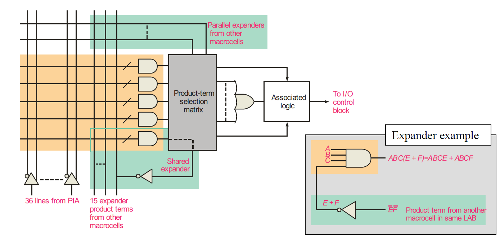

## 可编程逻辑 (Programmable Logic)

- **可编程逻辑器件（PLD）**：是一种集成电路（IC），包含大量的逻辑门和触发器，可以通过基本的软件配置以执行特定的逻辑功能或用于复杂电路的逻辑操作。

1. **SPLD (Simple Programmable Logic Devices)**：
   - **定义**：简单可编程逻辑器件，是最早期的阵列逻辑类型，用于固定功能和小型电路，具有有限数量的逻辑门。
   - **示例**：PAL（可编程阵列逻辑）和GAL（通用阵列逻辑）都属于SPLD。
   - **应用**：用于简单逻辑功能和小型电路设计。
2. **CPLD (Complex Programmable Logic Devices)**：
   - **定义**：复杂可编程逻辑器件，由多个SPLD阵列和单芯片上的互连阵列组成。
   - **特点**：比SPLD复杂，具有更多的逻辑门和更高的功能集成度。
   - **应用**：用于中等复杂度的逻辑设计和电路。
3. **FPLD (Field Programmable Gate Array, FPGA)**：
   - **定义**：**现场可编程门阵列**，比CPLD更灵活，具有更大的容量和更复杂的逻辑配置能力。
   - **特点**：具有更高的逻辑密度和灵活性，适合用于复杂的电路设计和广泛的应用领域。
   - **应用**：用于高复杂度的逻辑设计、大规模电路和多功能系统。

#### PLD 的优点包括：

- **降低电路板的复杂性**
  - 更低的功耗要求
  - 更少的电路板空间
  - 更简单的测试程序

- **更高的可靠性**

- **设计灵活性**

## PALs and GALs

- 所有可编程逻辑器件（PLDs）都包含阵列。两个重要的简单可编程逻辑器件（SPLDs）是PALs（可编程阵列逻辑）和GALs（通用阵列逻辑）。
- 一个典型的阵列由导体矩阵组成，这些导体以行和列的方式连接到与门（AND gates）。

- 在编程过程中，通过施加高电流或高电压，特定的熔丝被永久熔断。这意味着这些熔丝将被物理破坏，不能再导电。
- 熔断的熔丝决定了输入信号如何连接到与门，进而形成特定的逻辑功能。

example:

将X表达出来为$X = \overline{A} \times B + A \times \overline{B}$，为XOR gate。

## GAL

- **GAL（Generic Array Logic）**：类似于PAL，但**可以重新编程**。这使得GAL非常适用于新产品开发（原型设计）和培训用途。

- **重新编程**：与PAL不同，GAL可以重新编程，使其更加灵活和适应性强。

A single line can represent multiple gate inputs

可以理解为不同的字母通过一条线输入，跟之前是一样的

### macrocell

- **宏单元（macrocell）**：PAL和GAL中包含大规模的阵列逻辑，并包括复杂的输出逻辑。这些输出逻辑连接到每个或门（OR gate），整体被称为宏单元。
- **I/O 引脚**：这些特定的宏单元中的I/O引脚可以作为输入或输出使用。

- **输出逻辑的复杂性**：宏单元中的输出逻辑可以根据需要进行配置，以实现不同的逻辑功能。这种灵活性使得PAL和GAL适用于多种应用场景。
- **输入/输出功能**：宏单元中的I/O引脚可以根据具体应用需求配置为输入或输出，使得设计更加灵活。
- **高速度和高效性**：通过配置复杂的输出逻辑，PAL和GAL能够实现高速和高效的逻辑操作，适用于各种高速应用。

PAL和GAL中的宏单元结构通过复杂的输出逻辑提供了高灵活性和高效率。通过三态控制和可编程熔丝连接，宏单元能够实现多种逻辑功能，并且I/O引脚可以根据需要配置为输入或输出。这种设计使得PAL和GAL在多种应用中具有广泛的适用性和高效性。

## CPLDs

- **CPLD（复杂可编程逻辑器件）**：CPLD包含多个逻辑阵列块（LABs），这些LAB实际上是集成在单个IC上的SPLDs。
- **逻辑阵列块（LABs）**：这些块通过**可编程互连阵列（PIA）**连接起来。这个LABs相当于是一个SPLD
- **可编程互连阵列（PIA）**：用于在LABs之间进行互连。

- 逻辑通过高级编程语言（如硬件描述语言，HDL）配置到CPLD中。

对于需要更多产品项的表达式，可以通过扩展来实现。

- **多产品项生成**：每个宏单元最多可以生成五个产品项，满足一般逻辑表达式的需求。
- **扩展产品项**：通过并行和共享扩展器，可以生成更多的产品项，适用于复杂逻辑表达式。

### 复杂可编程逻辑器件的宏单元

- **组合逻辑**：一些宏单元支持组合逻辑，直接生成输出。
- **顺序逻辑**：一些宏单元具有寄存器输出，通过使用可编程触发器实现顺序逻辑。

## FPGA（现场可编程门阵列）

- **FPGA（Field Programmable Gate Array）**：FPGA使用的架构与CPLD不同，其基本单元是可配置逻辑块**（CLB）**。
- **CLB（Configurable Logic Block）**：CLB是FPGA的基本单元，被重复多次以构成整个FPGA。

1. **可配置逻辑块（CLB）**：
   - **结构**：CLB按行和列排列，每个CLB包含多个逻辑模块，通过局部互连连接。
   - **逻辑模块（Logic Modules）**：CLB内部包含多个逻辑模块，每个逻辑模块包含一个==**查找表（LUT）、一个触发器（flip-flop）和一个多路复用器（MUX）。**==
2. **逻辑模块的组成**：
   - **查找表（LUT，Look-Up Table）**：用于实现组合逻辑。
   - **触发器（Flip-Flop）**：用于实现时序逻辑。
   - **多路复用器（MUX）**：用于**选择输入**信号，可以绕过触发器实现纯组合逻辑。
3. **互连网络**：
   - **局部互连（Local Interconnect）**：用于连接同一个CLB内的逻辑模块。
   - **全局行互连（Global Row Interconnect）和全局列互连（Global Column Interconnect）**：用于连接不同CLB之间的逻辑模块，实现更复杂的电路设计。

这张图详细说明了FPGA中逻辑模块的配置方式和全局互连网络的作用。逻辑模块可以配置为组合逻辑、寄存逻辑或两者的组合，而全局互连网络则负责信号的分配。此外，FPGA还可能包含不能被用户重新编程的硬核逻辑部分，用于常用的功能。这些设计使FPGA既具有灵活性，又能在特定任务中提供高效的性能。