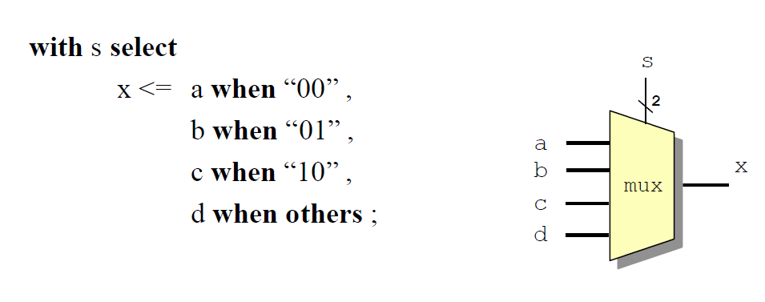
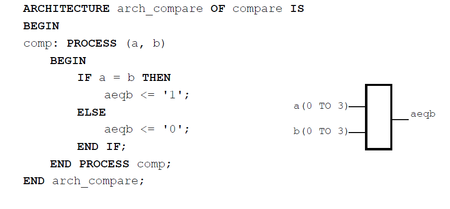

## Entity

1. **黑盒子（Black Box）：**
   - 黑盒子是一个抽象的概念，用于表示一个系统或模块，其内部实现对外部是不可见的。只有其输入输出接口（I/O）对外暴露。

2. **实体（Entity）描述：**
   - 实体描述了黑盒子的外围，即设计的输入输出接口（I/O）。
   - 幻灯片中的示意图展示了一个名为“BLACK_BOX”的模块，其接口包括：
     - **rst**（复位信号）
     - **d[7:0]**（8位数据输入）
     - **clk**（时钟信号）
     - **q[7:0]**（8位数据输出）
     - **co**（进位输出）

总结来说，实体描述了一个模块的外围接口，使得该模块可以被视为一个黑盒子，具体实现对外部不可见，只需了解其输入输出接口即可使用。这样的设计方式有助于模块化和抽象化设计，方便系统集成和测试。

## VHDL statements

1. **VHDL语句的类型：**
   - VHDL中有两种类型的语句：并发语句（Concurrent Statements）和顺序语句（Sequential Statements）。

2. **并发语句（Concurrent Statements）：**
   - 并发语句是指并行执行的语句。
   - 并发语句是“同时”执行的，这意味着这些语句不需要按顺序执行，而是在同一时间点被处理。
   - 并发语句的执行顺序不重要，即它们**可以在任何顺序下执行，结果都是一样的。**

3. **并发语句的例子：**
   - 逻辑表达式（Boolean Equations）
   - WHEN-ELSE语句
   - WITH-SELECT-WHEN语句

总结来说，**VHDL中的并发语句是同时执行的，其执行顺序不重要**。大多数VHDL设计中的例子都是并发语句，包括逻辑表达式、WHEN-ELSE和WITH-SELECT-WHEN等语句。这种设计方式有助于描述硬件的并行行为，使得VHDL能够有效地表示复杂的数字系统。

1. **顺序语句（Sequential Statements）：**
   - 顺序语句是指按顺序执行的语句。
   - 有时候，我们需要对复杂功能进行建模。在这种情况下，我们可以使用“算法”或模型来描述功能，这就是通过顺序语句完成的。

2. **顺序语句的执行顺序：**
   - 顺序语句的执行顺序非常重要，语句的顺序会影响最终结果。
   - 幻灯片中提到稍后会有例子展示这一点。

3. **使用过程（Process）来标记顺序语句块：**
   - 我们使用过程（process）来标记一个顺序语句块的开始和结束。
   - 每个完成的过程被认为是一个大的并发语句（Concurrent Statement），在一个架构（architecture）中可以有多个过程。

总结来说，顺序语句在VHDL中用于建模复杂功能，其执行顺序对结果至关重要。为了管理和组织这些顺序语句，我们使用过程来标记其开始和结束。在更高层次的设计中，每个过程作为一个整体，可以与其他并发语句一起并行执行。

Process要么是awake(active)要么是asleep(inactive)状态

一般来说在VHDL中的赋值用<=来表示，相等用=，关键字全部大写，AND和OR或者NOT。

或者也可以用下面的语句：

在这里二进制的数值就要加上双引号，这里首先有一个前提with s select。

或者也可以引入else when语句，这时候when就不需要单独出来形成结果了

## Sequential Statements: if-then-else

这里的elsif关键字要注意，没有了e，这个语句在执行上跟上面的when有执行顺序上的区别，是按照从上到下的顺序运行的。

### Case-When

## Variables

变量只能在PROCESS中使用，不可以在不同process之间传递信息

c := a AND b;

如果是这样去赋值的话，就代表c仅仅是一个变量而非signals。

### Comparator

或者：

