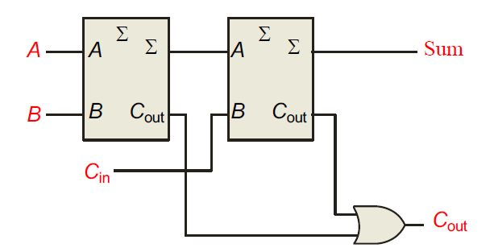

## Half-Adder

这里的$\Sigma$代表输出，$C_{out}$代表进位输出

## Full-Adder

可以把三个单个位的数进行相加，由两个半加法器组成，其中第一个半加法器输入为A,B，输出为$\sum$和$C_{out}$，然后第二个半加法器把第一个的输出$\sum$和$C_{out}$作为输入，最后得到结果为$C_{out}$和$\sum$

可以简单理解为三个相加，$C_{out}$是进位结果，$\sum$是个位数结果

## Parallel Adders

并行加法器是由多个全加器（Full Adders）组合而成的，可以对多个二进制位进行加法运算。图片中展示了一个4位加法器。

- **多位加法**：每个全加器处理二进制数的一个位。为了实现多位加法，多个全加器串联在一起，每个全加器的进位输出（*C*out）连接到下一个全加器的进位输入（*C*in）。
- **输入和输出**：4位加法器有8个输入（A4, B4, A3, B3, A2, B2, A1, B1）和5个输出（进位输出C4和4位的和输出Σ4,Σ3,Σ2,Σ1Σ4,Σ3,Σ2,Σ1）。

由于进位必须经过每一个全加器，最终的进位输出C4不能立即得到，需要等待所有进位传播完成，导致加法运算的速度受到限制。

## Look-Ahead Adder前瞻加法器

前瞻加法器通过提前计算进位，避免了涟漪进位（Ripple Carry）的延迟

### 进位生成信号和进位传播信号
- **进位生成信号（g\(_i\)）**：当两个输入A\(_i\)和B\(_i\)都是1时，进位生成信号为1。
  $$
  g_i = A_i \cdot B_i
  $$
- **进位传播信号（p\(_i\)）**：当至少有一个输入A\(_i\)或B\(_i\)为1时，进位传播信号为1。
  $$
  p_i = A_i + B_i
  $$

### 进位到下一阶段
进位信号$c(_{i+1})$由当前阶段的进位生成信号和进位传播信号决定：
$$
c_{i+1} = g_i + (p_i \cdot c_i)
$$
这里，$c(_{i+1})$可以在当前阶段生成，或者从前一阶段传播到下一阶段。

### 示例
举例说明进位信号的计算过程：
- 对于第一阶段：
  $$
  c_1 = g_0 + p_0 \cdot c_0
  $$
- 对于第二阶段：
  $$
  c_2 = g_1 + p_1 \cdot c_1 = g_1 + p_1 \cdot (g_0 + p_0 \cdot c_0) = g_1 + p_1 \cdot g_0 + p_1 \cdot p_0 \cdot c_0
  $$

### 总结
前瞻加法器通过计算进位生成信号和进位传播信号，能够提前计算出所有的进位，避免了逐级进位传播的延迟。这种方法显著提高了加法器的速度，对于高速数字电路设计非常重要。理解前瞻加法器的工作原理，可以帮助设计更高效的加法电路。

对于一个具体的4位并行加法器的实例74LS283芯片，输出进位的最大延迟为17纳秒。

## Expanding Adders

可以使用两个4位加法器来实现一个8位加法器。

### 实例解决方案（Example Solution）

- **方法**：将两个4位加法器级联，以实现对8位二进制数的加法运算。
- **连接方式**：第一个4位加法器的进位输出（$C_{out}$）连接到第二个4位加法器的进位输入（$C_{in}$）。

## Comparators(比较器)

比较器用于比较两个二进制数的大小，以确定它们之间的关系。在最简单的形式中，比较器可以使用异或非门（XNOR gates）来测试两个数**是否相等**。

## Comparators(可以比较大小)

中间的Cascading Inputs用于多位串联的比较器，比如要比较8位数的话就要用到两个这个元件，就可以前后串联，前者传入的就是之前4位的比较结果。

中间计算完之后相应的Output引脚就会输出高电平（1）。

- 级联输入 𝐴=𝐵*A*=*B* 设为高电平，表示开始比较时认为最低位相等。
- 𝐴>𝐵*A*>*B* 和 𝐴<𝐵*A*<*B* 接地，表示初始无比较结果。

前面的（左边的）比较器用于比较低位的数字，后面的比较器用于比较高位的数字。

e.g. A=1101_1010

B=1101_0111

首先左侧的*A*=*B* 设为高电平，*A*>*B* 和 A*<*B 接地，在比较完低四位的数字后，输出结果，此处因为A的第四位大一点，所以*A*>*B*，之后来到第二个比较器，因为高四位都一样，所以最后的output输出延续第一个比较器传出的结果，就是*A*>*B*。

**重点在于后面的比较器优先级永远是最大的，可以替代掉上一级的比较结果，如果没有区别的话才继承。**

## Decoders

最后每一位经过这个转化后都得是1才能将X输出为1或者0，图一就是Active HIGH decoder for 0011，也就是有效高解码器，最后输出为1.

图二就是有效低解码器for 0011，输出X为0

以上解码器4个输入对应16个输出，相当于是$2^4$种情况，每次只有一个输出引脚是1。

### 74HC154解码器

它包括两个有效低电平（active LOW）的片选线（chip select lines），这些片选线必须处于有效电平才能使能输出。

片选线 𝐶𝑆1 和 𝐶𝑆2 允许将多个74HC154芯片级联，以处理更大位数的输入。例如，可以将两个74HC154芯片级联，以实现5到32的解码。

比如我有一个五位数，但是也想要解码，这个时候我就将其最大位接到CS的其中一个上面，来实现2分类，原本的32可能性变成了2×16，这样就可以实现多位数的解码了，当然更多位就需要CS2之类的组合了。多一位的话CS2接地，CS1连最高位就行。

当CS1和CS2都是0的时候，传入$\overline{CS_{1}}$和$\overline{CS_{2}}$，则都是1，然后和操作，使能为1，则可以有输出。

## Decoders and minterms

0对应$\overline{ABC}$，7对应$ABC$，小圆圈代表低电平有效，即它被选中的时候就输出低电平，之后经过取反，高电平输入到了OR门，符合上述表达式。

相反也可以变成如下：

三个都不是1的时候AND门输出就是0，最后再取反一次变成1就行。

从上到下输出的顺序如下：

## seven-segment display七段显示器

解码器接收四位二进制编码的十进制输入（BCD），即输入引脚1, 2, 6和7分别为A, B, C和D。

输出引脚4, 13, 12, 11, 10, 9和15分别对应于七段显示器的a, b, c, d, e, f和g段。这些输出设计为低电平有效，即当需要点亮某个段时，相应的输出引脚为低电平。

- **Vcc**：引脚16，连接电源正极。
- **GND**：引脚8，连接电源负极。
- **LT（Lamp Test）**：引脚3，用于测试所有段，当LT为低电平时，所有输出段（a-g）都会点亮。
- **BI/RBO（Blanking Input/Ripple Blanking Output）**：引脚5，用于灭灯控制和级联多个显示驱动器。当BI/RBO为低电平时，所有段熄灭。当用于级联时，这个引脚也作为波纹空白输出。
- **RBI（Ripple Blanking Input）**：引脚4，用于输入波纹空白信号。

四个位输入对应16位的输出，也就是0~9，A到F，那么后面的outputs是低电平有效，则L的亮灯，H的不亮。

0011对应3，0000对应0，前面两个，RBI接收到低电平，其低电平有效，同时因为输入是0000，触发消隐Blanked，第三个虽然RBI接收低电平，但是输入不为0000，则正常输出。最后一个RBI接收高电平，正常工作，正常输出相应结果。

e.g.

第一个虽然RBI接入低电平但是0111有效，输出7，第二个输出5，第三个0，第四个0。

## 74LS47 with decimal point

小数点后的零实现消隐的方式如下

当小数点右侧的数字为0时，74LS47解码器会自动抑制这些零的显示。这是通过将RBI输入连接到后续解码器的BI/RBO输出来实现的。BI/RBO引脚用于控制和传播消隐信号，使右侧的零被消隐。

## Encoders

这个编码器接收一个十进制数字的输入，并输出四位BCD码，代表当前有效输入的十进制数字。

- **输入端**：1到9表示十进制的输入。图中没有0的输入，因为当输入为0时，所有输出端都是低电平（即输出0000）。

- 输出端：

  - *A*0：最低位（LSB）
  - *A*1
  - *A*2
  - *A*3：最高位（MSB）
  
- **输出 𝐴0**：由输入1、3、5、7、9控制。这些输入通过 OR 门连接到 𝐴0*A*0，当这些输入中任意一个有效时，𝐴0*A*0 输出为高电平（1）。
- **输出 𝐴1**：由输入2、3、6、7控制。这些输入通过 OR 门连接到 𝐴1*A*1，当这些输入中任意一个有效时，𝐴1*A*1 输出为高电平（1）。
- **输出 𝐴2**：由输入4、5、6、7控制。这些输入通过 OR 门连接到 𝐴2*A*2，当这些输入中任意一个有效时，𝐴2*A*2 输出为高电平（1）。
- **输出 𝐴3**：由输入8、9控制。这些输入通过 OR 门连接到 𝐴3*A*3，当这些输入中任意一个有效时，𝐴3*A*3 输出为高电平（1）。

只要有一个满足，就会输出高电平。

### 74HC147 

- 输入输出都是是低电平有效的，这意味着输入或者输出的某个位为低电平时，该位为1。

- 74HC147是一个优先编码器，这意味着如果多个输入同时有效，编码器会选择编号最高的输入进行编码。
- 例如，如果输入3和输入5同时有效，编码器会选择输入5，因为5的优先级高于3。

### 74LS148

EO是使能输出引脚，用于指示编码器的输出是否有效。**当编码器的所有输入都为高电平（即没有有效输入）时，EO输出低电平**；当有一个或多个输入有效时，EO输出高电平。EO引脚可以用于级联多个编码器。例如，在更大范围的输入中，多个74LS148编码器可以级联使用，通过检测EO引脚的状态来确定是否有有效输入。

GS是组选择引脚，用于指示当前是否有有效输入信号。GS引脚的输出与编码器的输入状态直接相关，**当有任何一个输入有效时，GS为低电平**；当没有有效输入时，GS为高电平。GS引脚通常用于指示当前编码器是否处于活动状态，并且可以用于更复杂的电路设计中，通过检测GS引脚来控制其他逻辑电路的操作。

### Encoders Expansions

## Code converters

格雷码通过不断地与上一位进行异或操作得到，不一样则为1，一样则为0。

## Multiplexers多路复用器

多路复用器（MUX）是一种选择器电路，它从多个输入数据线中选择一条数据线，并将选中的数据线的数据路由到输出端。选择具体哪条数据线由选择输入（select inputs）决定。

- S1S0 = 00 时，选择 D0
- S1S0 = 01 时，选择 D1
- S1S0 = 10 时，选择 D2
- S1S0 = 11 时，选择 D3

当S1S0=10时，选择D2

直接二位二进制转十进制就行。

e.g. 

只有当AB为1，C为0的时候，输出才为1，AB固定输入上面的选择端口，对应下面的3，所以C‘输入到3。

这里将XYZ输入到选择端口，当然也可以将W输入到上面，然后XYZ选一个输入到下面，然后这种题先将逻辑代数展开，然后用代数化简，然后最后将W，W’，1还有0分别输入到信息端口，也就是说除了1，W，W‘以外所有的端口都输入0就行。

## Demultiplexers

解多路复用器（DEMUX）执行与多路复用器（MUX）相反的功能。它将来自一个输入的数据切换到多个数据线中的一个，具体由选择输入决定。图中的74LS138是一个3线至8线的解多路复用器/解码器。

这里A0A1A2就是多个数据线的输入，经过这个解复用器可以将数据以一条线路输出。$2^3$对应8个结果。

1. **使能条件**：
   - G1 为高电平且 G2A 和 G2B 为低电平时，DEMUX工作。
   - 任何一个使能输入无效（G1为低电平或G2A/G2B为高电平），所有输出都为高电平。

## Parity Generators/Checkers奇偶校验器

奇偶校验是一种错误检测方法，它通过在一组比特后附加一个额外的比特来使其总的“1”的数量为奇数或偶数。在偶校验（Even Parity）中，总的“1”的数量为偶数；在奇校验（Odd Parity）中，总的“1”的数量为奇数。

检验字符串中1的个数，如果不是奇或者偶的话就在最左侧补1实现奇数或者偶数1，如果满足的话就加0就行

