## Latches

- **锁存器**是一种暂时存储装置，具有两个稳定状态（双稳态），是一种基本的存储形式。

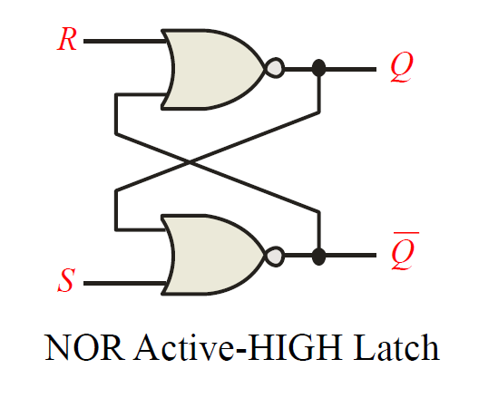

NOR Active-LOW Latch

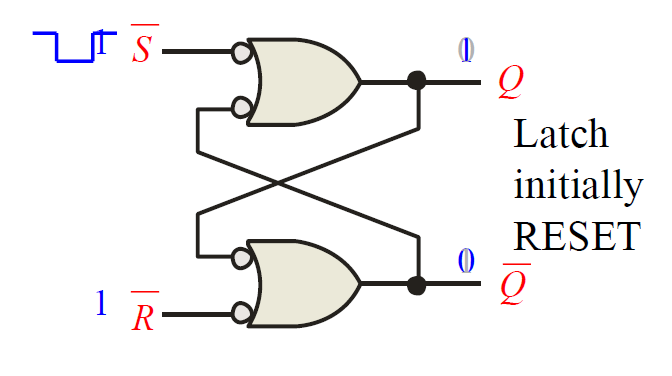

上述S-R(Set-Reset) latch是最基本的latch型号；它可以由NOR或者NAND gates.

相应来说在NOR情况下，latch反映于高电平；在NAND情况下，latch反映于低电平。

不可以同时active set和reset。

由NAND门或NOR门组成的S-R锁存器在逻辑功能上是相似的，它们都可以实现基本的设置（Set）和重置（Reset）操作。然而，这两种门构建的锁存器在电平有效性、逻辑构成和一些性能特点上有所不同。

1. **NOR门构成的S-R锁存器**：
   - 输入：S和R输入在低电平时是无效的（也就是说，当S和R都是0时，锁存器保持当前状态），在高电平时有效。
   - 电路构成：由两个NOR门互相连接形成。
   - 逻辑功能：当S=1，R=0时，锁存器**置位（Set）**,Q=1；当S=0，R=1时，锁存器**重置（Reset）**,Q=0；当S=0，R=0时，保持原状态；当S=1，R=1时为禁止（因为这可能会导致不确定的输出）。

总的来说，NOR门锁存器在输入电平的有效性上与NAND门锁存器相反。除此之外，由于NOR和NAND门的电路特性不同，它们在实现时的电源消耗、速度和其他电气特性上可能会有差异。在实际应用中，选择使用哪种类型的锁存器通常取决于特定应用的逻辑需求和电气特性要求。

Latches may be used to avoid switch bouncing.

## Latch with EN

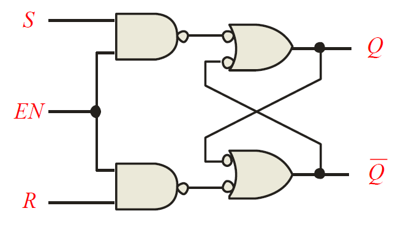

==Keep in mind that S and R are only active when EN is HIGH.==

当EN（使能信号）为HIGH时，锁存器对S（置位）和R（复位）信号敏感。此时：

- 如果 **S=HIGH** 且 **R=LOW**，锁存器的输出 **Q** 将被置为 **HIGH**，而 \($\overline{Q}$\)（Q的非或补充输出）将为 **LOW**。
- 如果 **S=LOW** 且 **R=HIGH**，锁存器的输出 **Q** 将被置为 **LOW**，而 \($$\overline{Q}$$\) 将为 **HIGH**。
- 如果 **S=LOW** 且 **R=LOW**，Q保持之前的原有状态
- 如果 **S=HIGH** 且 **R=HIGH**，Q保持之前的原有状态

最后两种情况对于NOR门构成的锁存器来说是颠倒的，因为NOR锁存器在S和R都为HIGH时会保持当前状态，而在S和R都为LOW时会导致不确定状态。

所以总结一下，在EN=HIGH时：

- **对于NAND构成的锁存器**：S和R都不应同时为LOW。
- **对于NOR构成的锁存器**：S和R都不应同时为HIGH。

对于有使能的latch，不用判断是nor还是nand gate，因为有使能的话两个成分都有，直接用上述公式得到Q的结果即可。

## 优化后latch

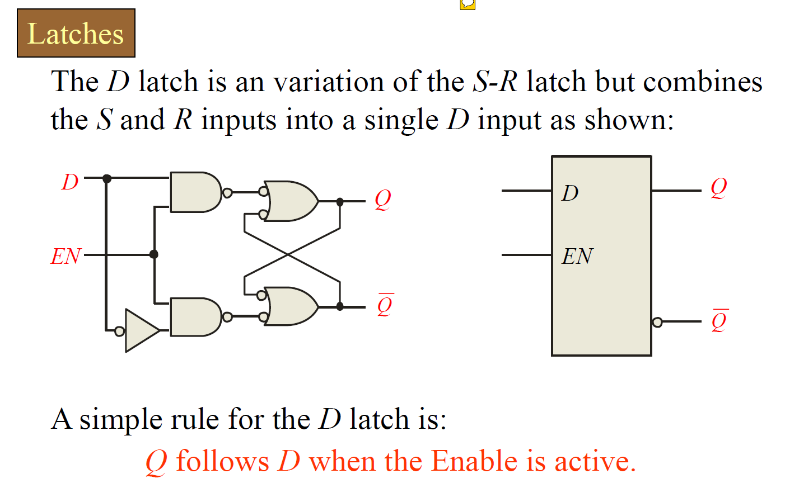

为了防止S和R发生冲突，用D来替换二者。

现在Q和D会保持一致（当使能）为高电平

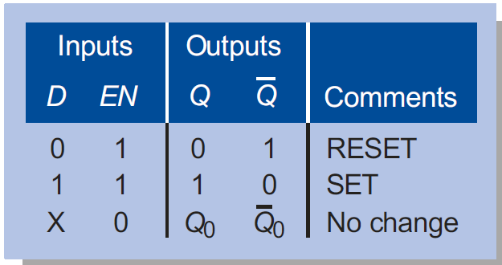

上述的触发器有一些缺点：

由于S，R或者使能的转变并不是同时发生的，也就代表着可能会出现短暂时间内信号跳动。

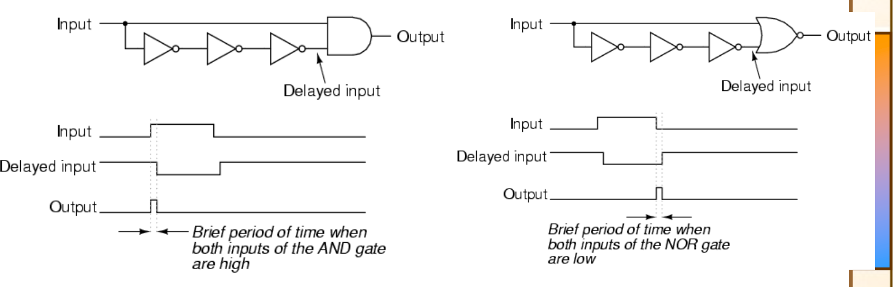

反向器会造成信号传输的延迟。

## Flips-flops

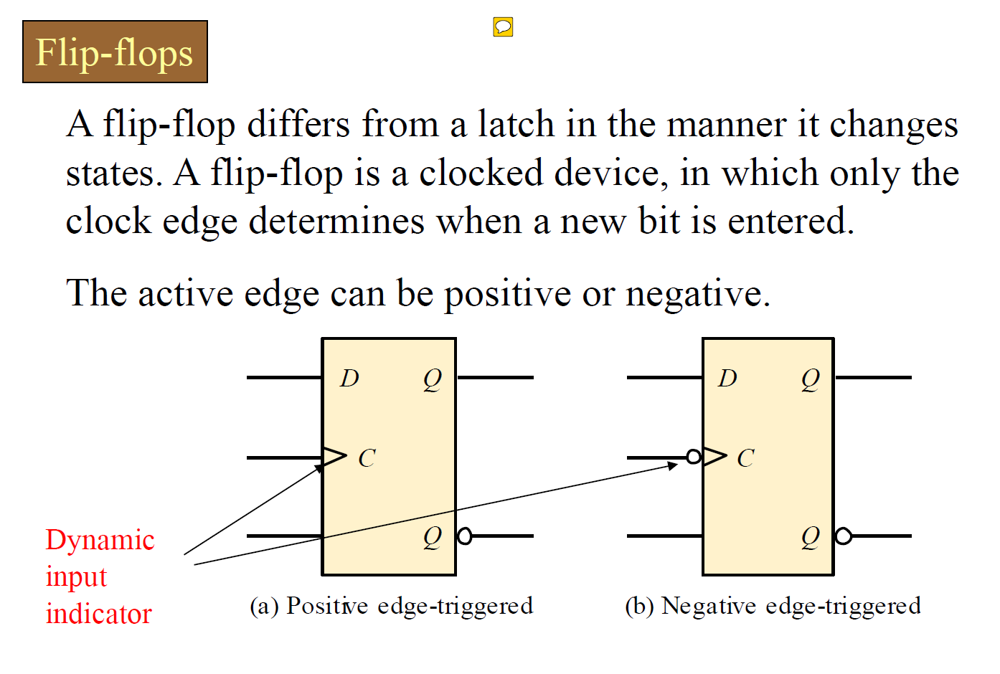

这张图展示的是两种类型的D型触发器（Flip-Flop）的符号表示，它们分别是正边沿触发（Positive edge-triggered）和负边沿触发（Negative edge-triggered）。

触发器是一种时序逻辑电路元件，用于存储一位二进制信息。与锁存器不同的是，触发器只在时钟信号的特定边沿（上升沿或下降沿）响应，而不是在整个高电平或低电平期间响应。这种特性使得触发器在数字电路中非常适合用作同步数据存储和传输。

- **（a）正边沿触发**：这种类型的触发器只在时钟信号C从低电平变为高电平（即上升沿）时捕获D输入端的数据，并将其传输到输出Q。它通常用一个三角形和一个小的正边沿标记（从左到右上升的小斜线）来表示。

- **（b）负边沿触发**：这种触发器只在时钟信号C从高电平变为低电平（即下降沿）时捕获D输入端的数据，并将其传输到输出Q。它通常用一个三角形和一个小的负边沿标记（从右到左下降的小斜线）来表示。

在这两种触发器中，时钟信号C是用来同步输入数据的关键。由于它们对时钟信号的边沿反应敏感，所以能在整个系统中保持数据的同步，避免了锁存器中可能出现的时序问题。在设计时序关键的数字系统时，触发器是非常关键的组件。

区别于latches，前者是瞬间发生信号变化，这里的flip-flop引入了clock时钟。

## D Flip-flops

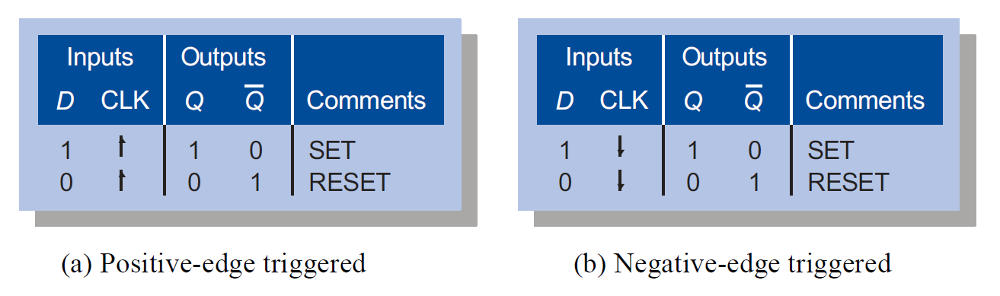

clock ⬆ 代表时钟信号从低电平到高电平

clock ⬆ 则Q与D保持一致

## J-K flip-flops

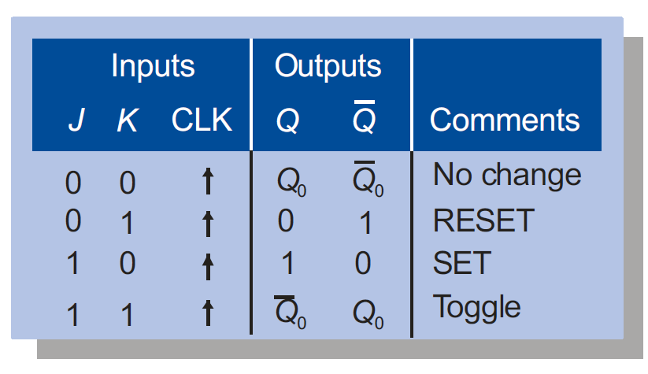

对于输出Q：**当JK值不同时，保持与J同值**，当JK相同时，都为零则不变，都为一则取反

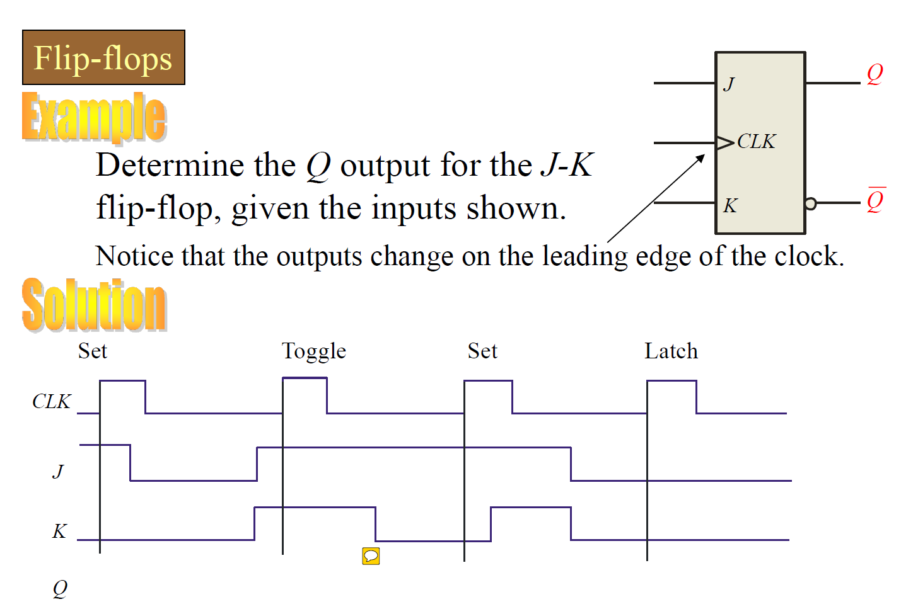

只有在CLK发生变化的时候，Q才会重新判断是否需要发生变化
**所以，只有在黑竖线的位置才会发生变化**
Q从一开始到Toggle都是高电平，经过Toggle之后变成低电平，经过Set之后再变成高电平，最后经过Latch continue

要实现每一个脉冲时刻自动翻转，可以加入一个反向输出的连接
要给D型触发器添加切换功能，你可以将‾*Q*（Q的反相输出）反馈到D输入端。这样设置后，每次时钟信号上的活动边缘发生时，触发器的输出都会从当前状态切换到相反状态。如果Q是LOW，则‾*Q*是HIGH，D输入接收到HIGH，在下一个时钟边沿，Q将变成HIGH。下一次时钟脉冲来临时，因为Q已经是HIGH，‾*Q*会是LOW，D输入接收到LOW，所以下一个边沿Q将变成LOW。如此循环，Q的状态在每个时钟脉冲上翻转。

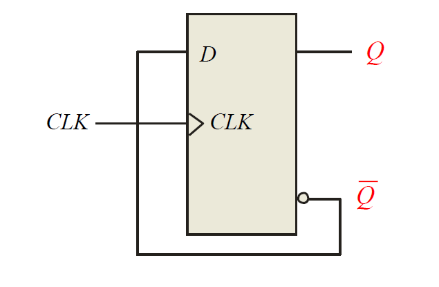

D Flipflop可以通过把$\bar{Q}$输入到D实现每次脉冲时刻反相。

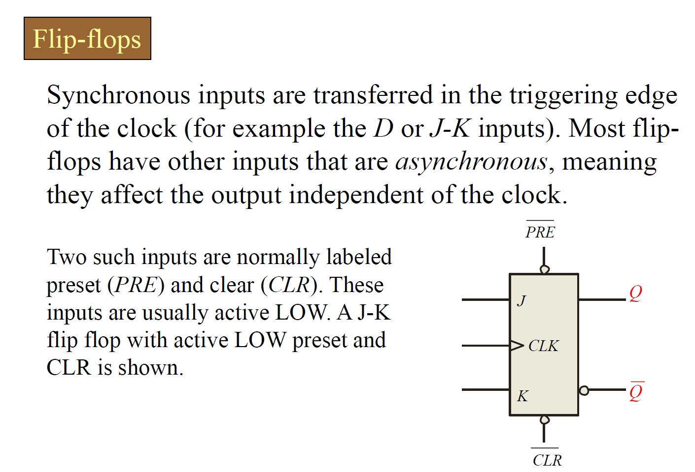

这张图描述了J-K触发器的一个变种，它除了常规的同步输入J和K以及时钟输入CLK之外，还包括了两个异步输入：预置（PRE）和清除（CLR）。这些异步输入可以不考虑时钟信号CLK的状态，立即改变触发器的输出状态。

- **PRE（Preset，预置）**：这是一个异步输入，**当它被激活（低电平，即active LOW）时**，会立即将触发器的**Q输出设置为高电平（HIGH）**，不管时钟信号CLK的状态如何。

- **CLR（Clear，清除）**：这也是一个异步输入，**当它被激活时（同样是低电平有效）**，会立即将触发器的**Q输出清除为低电平（LOW）**，不考虑时钟信号CLK的状态。

在这种设计中，**即使没有时钟信号，或者时钟信号在非活动边沿，只要PRE或CLR被激活，触发器的输出Q就会立即响应**。这允许设计者在电路需要快速重置或设置到特定状态时进行控制，例如在电源上电时或系统需要快速响应某些事件时。

请注意，在实际电路中，通常会通过逻辑门或其他措施来确保不会同时激活PRE和CLR，因为这样会导致冲突的指令，使得输出状态不确定。

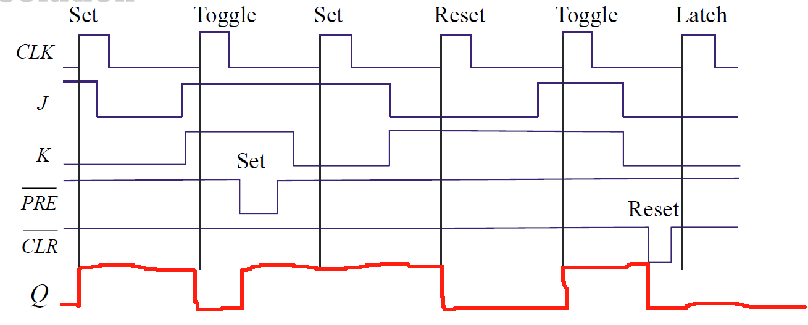

在经历了PRE和CLR的强制状态后，Q会保持在强制时候的状态输出，直到下一个CLK↑再判断。

### flipflop传播延迟时间

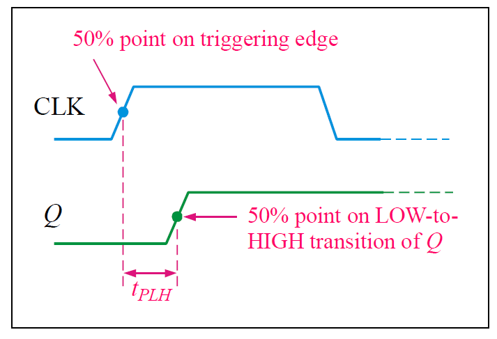

CLK和Q的反应时间有一定的延迟，图中计算变化的中值位置的时间差。

74AHC family (CMOS) is 4 ns

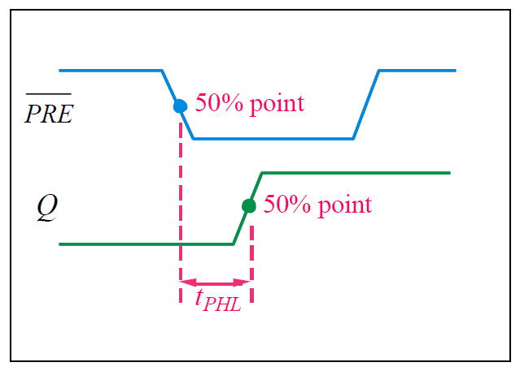

这个有5 ns

## Set-up Time/ Hold Time

建立时间是数据在时钟信号的有效边沿（通常是上升沿）之前必须保持稳定存在的最小时间。

保持时间是数据在时钟信号的有效边沿（通常是上升沿）之后必须保持稳定存在的最小时间。

这两个参数对于确保触发器能够可靠地工作至关重要，违反这些时间要求会导致触发器的输出不稳定或错误。

### 其他特性

- **最大时钟频率**：触发器可以可靠工作的最大时钟频率。
- **最小脉冲宽度**：各种输入信号所需的最小脉冲宽度，以确保触发器能正确识别这些信号。

- **功耗**：功耗是电源电压与平均电流的乘积。这个值通常表示为瓦特（W）或毫瓦（mW）。

速度-功耗积（Speed-Power Product）

- **定义**：速度-功耗积是用于比较不同逻辑系列的一个有用参数，它使用两个规格：平均传播延迟和平均功耗。单位是能量（如焦耳，J）。
- **计算公式**：速度-功耗积 = 平均传播延迟 * 平均功耗

### Flip-Flop应用

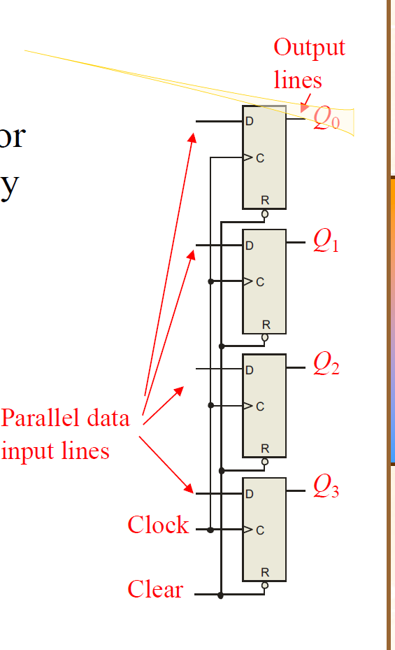

主要的触发器应用包括临时数据存储、作为频率分频器和计数器

### 频率分频

使用触发器进行频率分频非常简单，可以将触发器设置为翻转模式（toggle mode）或将一系列翻转触发器串联起来以继续进行二分频。

- 一个触发器将输入频率 𝑓𝑖𝑛 除以2。
- 两个串联的触发器将 𝑓𝑖𝑛 除以4，以此类推。

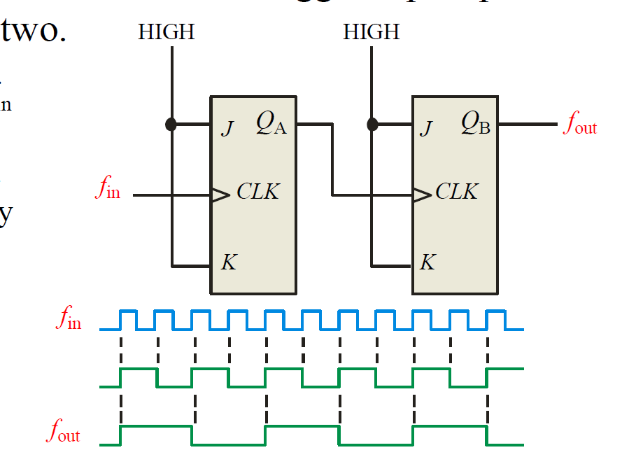

- 输入信号 𝑓𝑖𝑛*f**in* 进入第一个触发器 𝑄𝐴*Q**A*，输出信号经过第一个触发器后传递给第二个触发器 𝑄𝐵*Q**B*，最终得到输出频率 𝑓𝑜𝑢𝑡*f**o**u**t*。

### Edge-triggering

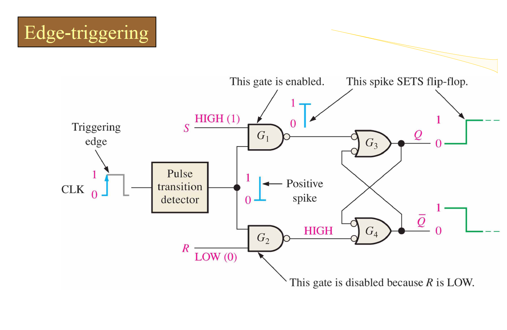

边沿触发的工作机制依赖于时钟信号的跳变沿（上升沿或下降沿）来改变触发器的状态。图中展示了一个边沿触发器的结构及其工作过程。

- 时钟信号（CLK）的跳变沿（从0到1的上升沿）触发一个脉冲转换检测器（Pulse transition detector）。

- 该检测器在检测到时钟信号的上升沿时产生一个正脉冲（Positive spike）。

### T 触发器 Toggle 触发器

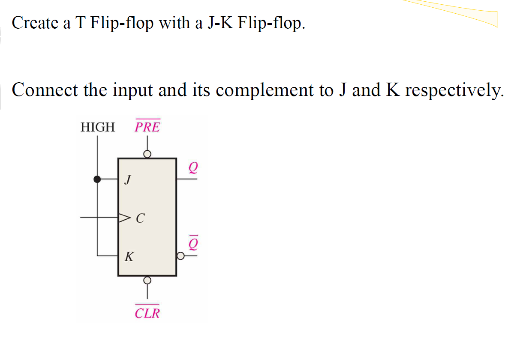

只用将HIGH接到JK上，实现每次触发都反转

### D 触发器

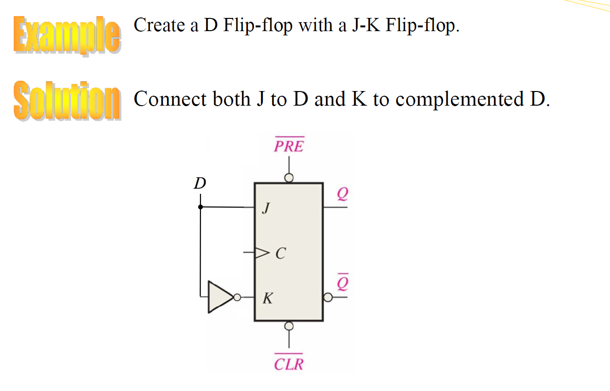

只用将两个相反的信号分别输入到JK，就可以固定成两种情况，这个时候也只与J有关

### 扫描触发器Scan Flip Flop

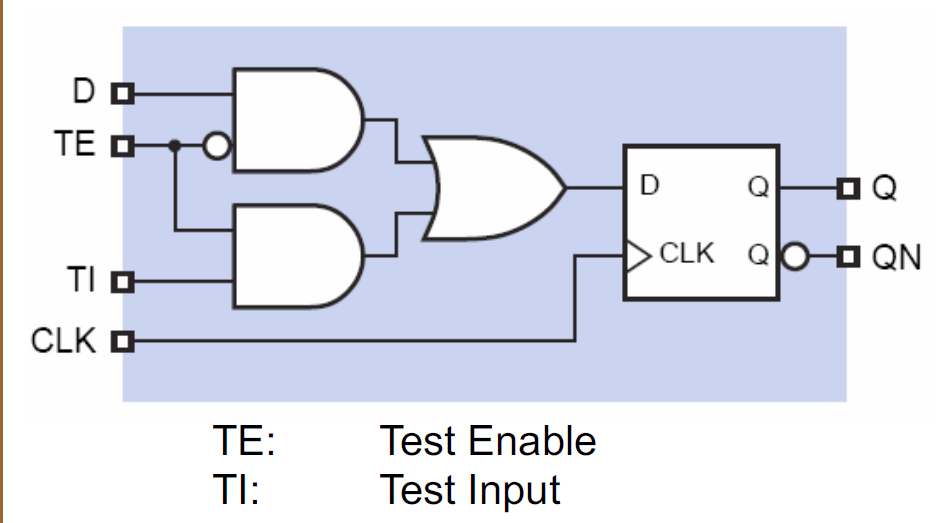

TE端来决定到底D和TI哪个输入，如果TE为高则只看下面的AND门，那么就是只关于TI输入，如果TE为低则只看上面的AND门，只看D输入，之后通过一个OR门输入到D触发器中，之后判断与之前一致。

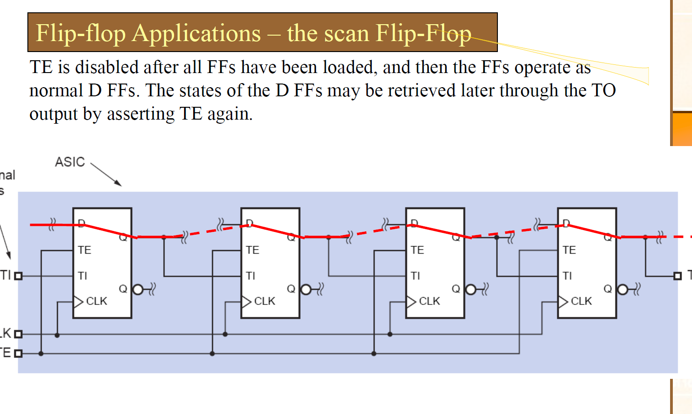

### One-Shot单稳态触发器

单稳态触发器是一种只有一个稳定状态的器件。当被触发时，它会进入不稳定状态，并在预定时间后返回到稳定状态。

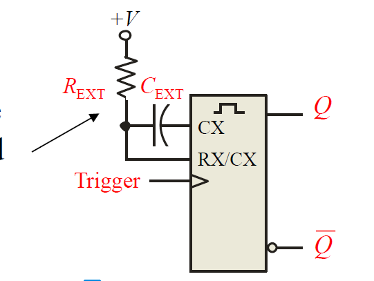

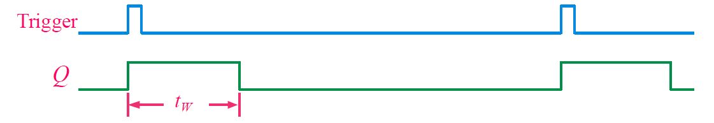

- 触发信号（Trigger）为一个短脉冲，当触发器检测到这个脉冲时，它会从稳定状态转变到不稳定状态。

- 触发器在不稳定状态下保持一段时间，这段时间由外部RC电路决定。

- 在不稳定状态期间，输出 𝑄*Q* 保持高电平。

- 在预定的时间结束后，触发器自动返回到稳定状态，输出 𝑄*Q* 返回低电平。

### $t_W$触发时间

- 外部电阻 𝑅𝐸𝑋𝑇*R**EXT* 和电容 𝐶𝐸𝑋𝑇*C**EXT* 组成的RC电路决定了触发器在不稳定状态下的持续时间 𝑡𝑊*t**W*。
- 通过调整 𝑅𝐸𝑋𝑇*R**EXT* 和 𝐶𝐸𝑋𝑇*C**EXT* 的值，可以改变 𝑡𝑊*t**W* 的长度。

$t_W = R_{EXT} \times C_{EXT}$

### 非重/重触发单稳态触发器（Nonre/retriggerable One-Shots）

区别就是在非稳定状态下，ff能否再次接收trigger信号，并实现$t_W$的延长，重触发可以做到，但是非重触发做不到。

#### 非重触发单稳态触发器（Nonretriggerable One-Shots）

- **定义**：非重触发单稳态触发器在不稳定状态下不会响应任何触发信号。
- **行为**：当触发器进入不稳定状态后，即使有新的触发信号到来，它也不会改变其状态或延长不稳定时间。

#### 重触发单稳态触发器（Retriggerable One-Shots）

- **定义**：重触发单稳态触发器在不稳定状态下会响应任何新的触发信号。

- 行为：

  - 如果在不稳定状态期间有新的触发信号到来，不稳定状态会被延长。
- 延长的时间等于触发信号的脉宽。

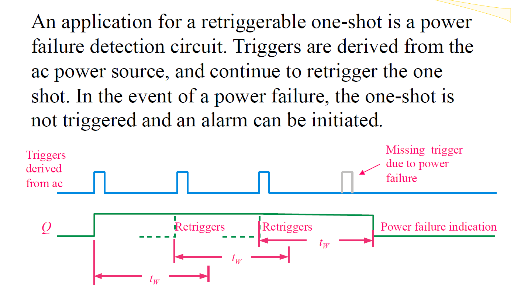

## 555 Timer

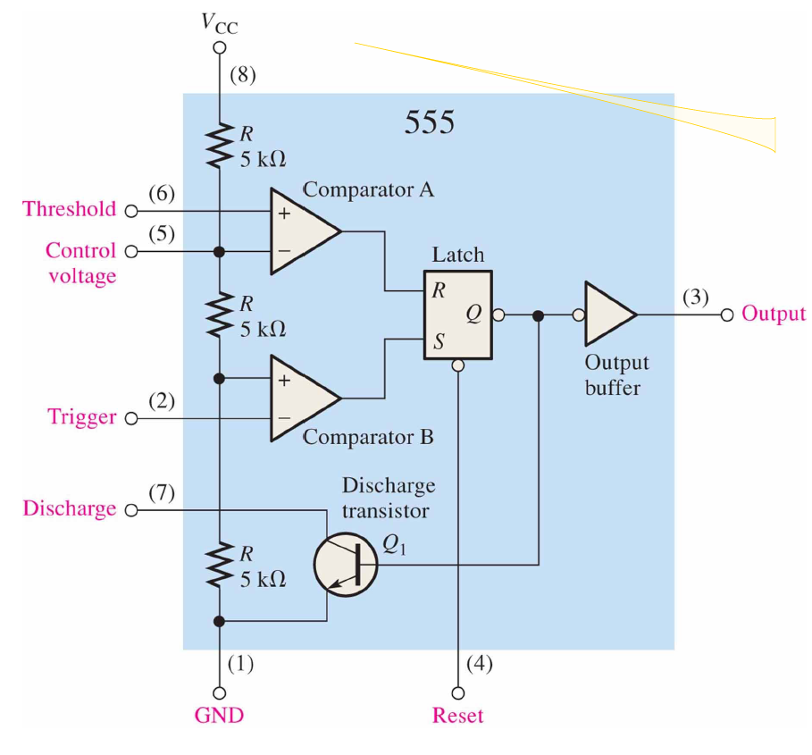

锁存器是R-S锁存器，用于保持输出状态。表格展示了R-S锁存器的真值表：

| S    | R    | Q    | 说明                      |
| ---- | ---- | ---- | ------------------------- |
| 0    | 0    | NC   | 保持当前状态              |
| 0    | 1    | 0    | 复位状态                  |
| 1    | 0    | 1    | 设置状态                  |
| 1    | 1    | 0    | 典型逻辑：不允许/复位状态 |

- **S（Set）**：设置输入，设置锁存器的输出Q为1。
- **R（Reset）**：复位输入，将锁存器的输出Q复位为0。
- **Q（Output）**：锁存器的输出，根据输入S和R的状态变化。

### 比较器（Comparator）

比较器用于比较两个输入电压 \( V_{I+} \) 和 \( V_{I-} \)，并输出一个高或低电平信号。

- **输入端**：
  - **正输入（V_{I+}）**：比较器的正输入端。
  - **负输入（V_{I-}）**：比较器的负输入端。
- **输出**：
  - 当 \( V_{I+} > V_{I-} \) 时，输出高电平（1）。
  - 当 \( V_{I+} < V_{I-} \) 时，输出低电平（0）。
- **特点**：比较器具有非常高的输入阻抗。

### 双极结型晶体管（BJT）

BJT用于放大或开关应用。表格展示了BJT的状态和工作原理：

| b（基极）      | BJT状态     | 集电极电压（c）       | 说明       |
| -------------- | ----------- | --------------------- | ---------- |
| 高电平（HIGH） | 开启（On）  | 与发射极（e）电压相同 | 晶体管导通 |
| 低电平（LOW）  | 关闭（Off） | 与发射极（e）断开     | 晶体管截止 |

- **基极（b）**：控制晶体管导通或截止的输入。
- **集电极（c）**：输出电压端。
- **发射极（e）**：电流输出端或参考电压。

- **晶体管符号说明**：
  - 当基极电压为高时，晶体管导通，集电极与发射极电压相同。
  - 当基极电压为低时，晶体管截止，集电极与发射极断开。

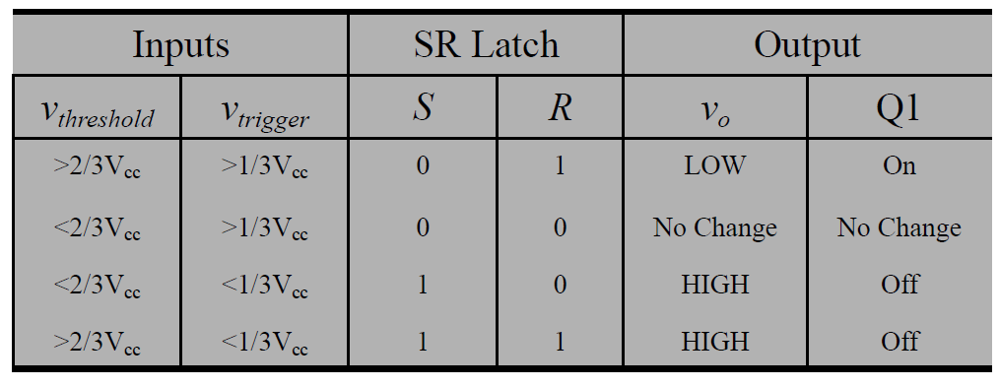

### 555 Timer as one shot

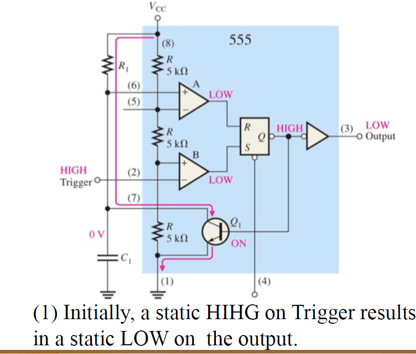

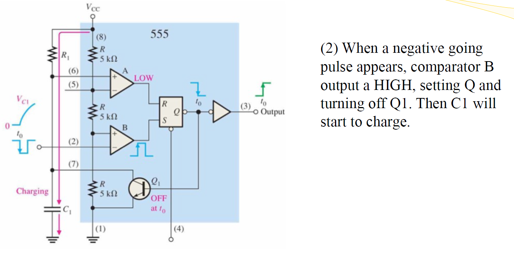

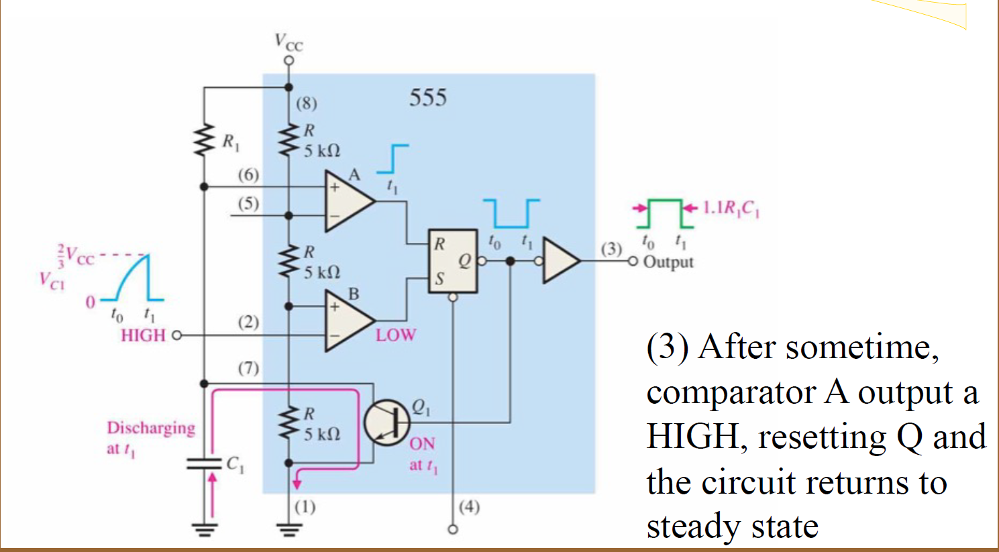

#### 工作原理

右侧的图展示了555定时器在单稳态模式下的工作原理：

1. **初始状态**
   - 初始时，触发信号（Trigger）为高电平，输出为低电平。
   - 放电晶体管 \( Q_1 \) 导通，使电容 \( C_1 \) 放电。

2. **触发脉冲**
   - 当触发信号变为低电平的瞬间时（即接近地电压），比较器B的输出变为高电平，设置R-S锁存器，输出变为高电平。
   - 同时，放电晶体管 \( Q_1 \) 关闭，电容 \( C_1 \) 开始通过电阻 \( R_1 \) 充电。

3. **不稳定状态**
   - 在不稳定状态期间，输出保持高电平，电容 \( C_1 \) 持续充电。
   - 当电容电压达到2/3 V\_CC时，比较器A的输出变为高电平，复位R-S锁存器，输出变为低电平。
   - 放电晶体管 \( Q_1 \) 重新导通，电容 \( C_1 \) 放电。

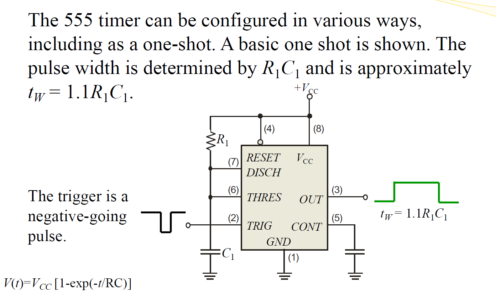

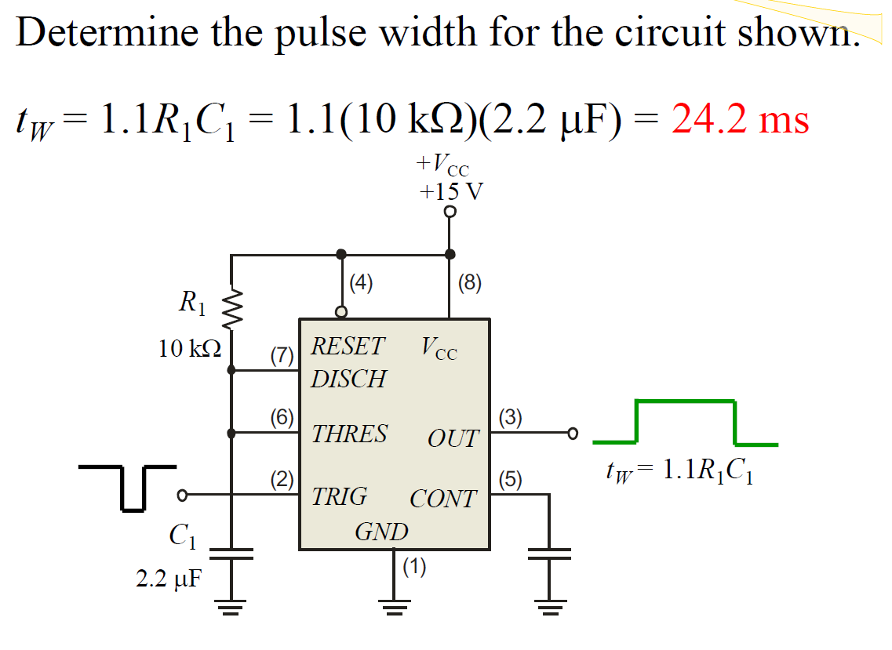

### 555定时器作为无稳态多谐振荡器

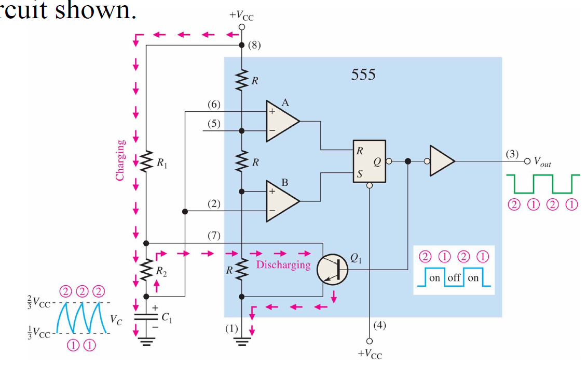

这张幻灯片介绍了如何将555定时器配置为无稳态多谐振荡器（Astable Multivibrator），并展示了其工作原理。以下是主要内容的解释：

---

### 555定时器作为无稳态多谐振荡器

#### 工作原理

1. **充电阶段**
   - 初始状态下，电容 \( C_1 \) 开始通过电阻 \( R_1 \) 和 \( R_2 \) 充电。
   - 当电容电压 \( V_C \) 达到2/3 V\_CC时，比较器A的输出变为高电平，复位R-S锁存器，输出变为低电平。
   - 放电晶体管 \( Q_1 \) 导通，电容 \( C_1 \) 开始放电。

2. **放电阶段**
   - 在放电阶段，电容 \( C_1 \) 通过电阻 \( R_2 \) 放电。
   - 当电容电压 \( V_C \) 下降到1/3 V\_CC时，比较器B的输出变为高电平，设置R-S锁存器，输出变为高电平。
   - 放电晶体管 \( Q_1 \) 关闭，电容 \( C_1 \) 开始重新充电。

#### 周期计算

无稳态多谐振荡器的振荡周期 \( T \) 由电阻 \( R_1 \)、\( R_2 \) 和电容 \( C_1 \) 决定，公式如下：

$T = 0.693 \times (R_1 + 2R_2) \times C_1$

占空比 \( D \) 由电阻 \( R_1 \) 和 \( R_2 \) 决定，公式如下：

$D = \frac{R_1 + R_2}{R_1 + 2R_2}$

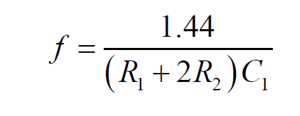

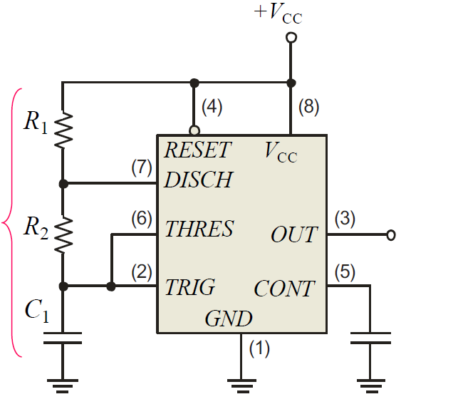