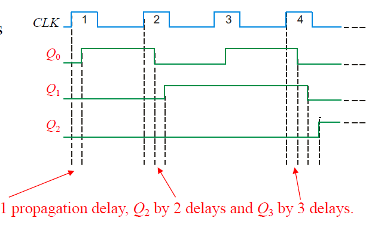
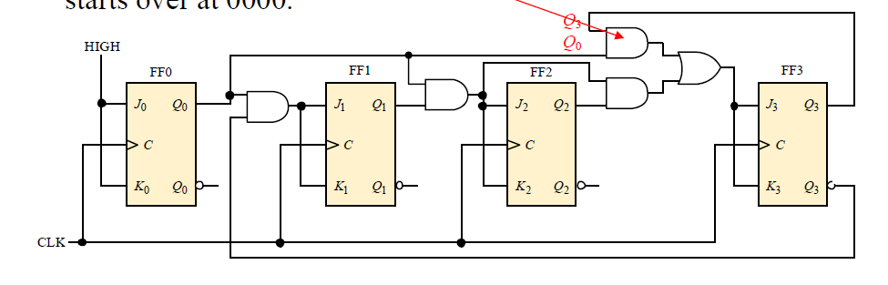

## Counting Binary

LSB代表最高有效位

MSB代表最低有效位

图中表示进制

## Three bit Asynchronous Counter三位异步计数器

异步计数器（也称为脉冲计数器）中的时钟信号只应用于第一个阶段。后续阶段的时钟信号由前一个阶段的输出信号派生出来。这种设计在逻辑电路中非常常见，用来减少时钟信号在整个电路中传播的复杂性。

选择$\overline{Q_0}$而不是$Q_0$作为下一个的时钟信号输入的原因是取反信号可以提供一个稳定的时序点，确保计数器在正确的时刻进位。避免在某些情况下触发器之间的时序问题，从而引起不必要的振荡。

## 延迟问题

在异步计数器中，第一个触发器由时钟信号（CLK）直接驱动，而后续的每个触发器都是由前一个触发器的输出驱动。因此，每个触发器的输出信号会有一定的延迟，这种延迟称为传播延迟（propagation delay）。

由于这些累积的传播延迟，异步计数器在高频率应用中会表现不佳，时序上的不精确会影响系统的整体性能。

## Asynchronous Decade Counter异步十进制计数器

- 该计数器使用部分解码技术，当计数器达到特定状态时，通过清除信号（CLR）将计数器复位为零。这里，该特定状态是1001（即十进制的9）。

这些触发器在**下降沿触发模式**下工作。

- 每个触发器在其输入时钟信号的下降沿翻转其状态。通过这种方式，计数器会依次计数，输出信号分别为 *Q*0、*Q*1、*Q*2、*Q*3。
- 当输出状态达到1001（ Q*3*Q*2*Q*1*Q*0=1001）时，电路的部分解码逻辑检测到这一状态，并生成清除信号（CLR），将所有触发器复位。

- 在输出信号*Q*3 和 *Q*1 同时为高（1）的情况下，CLR信号被激活,CLR低电平触发，所有触发器清零

### 74LS93A异步计数器

74LS93A是一种4位二进制计数器，由一个独立的J-K触发器和三个级联的J-K触发器组成。

**独立触发器（J0K0）**独立工作，不依赖于其他触发器的输出。

**级联触发器（J1K1、J2K2、J3K3）**由时钟信号CLKB驱动。

**清零输入（RO1和RO2）**连接到高电平（HIGH），用于复位计数器。

相当于是手动清零

如果要拓展成4位计数器的话就将$Q_0$输入到CLKB上，从而得到一个频率减半的信号，适用于驱动后续级联的触发器。

## 同步计数器

- 在同步计数器中，所有的触发器都由同一个时钟信号（CLK）驱动。这样可以确保所有触发器在同一时间进行状态转换，避免了累积的传播延迟。

## 4位同步计数器

## BCD十进制计数器

BCD十进制计数器是一种特殊的同步计数器，它在计数到十（1001）时会自动复位到零（0000）。

1001对应9，之后下一个数就是0000对应0。

在BCD编码中，将原来十进制的每一位数单独拿出来，然后转换成4位二进制数，然后这个数肯定是小于等于1001的，然后每到1001之后进行复位操作。

关于第一个$Q_0$到FF1之间，由于$Q_3$一开始是0，则取反后传出来是1，J1K1也是1，但是由于第一个CLK已经过去，不能再判断并变化，则Q1暂时不变；到了第二个clk上升沿之后，才再次判断并变化。

## **4-bit Synchronous Binary Counter** 4位同步二进制计数器

具体型号为74LS163

数据输入：

- CLR (1): 复位输入
- LOAD (9): 加载输入
- ENT (10): 使能输入
- ENP (7): 使能输入
- CLK (2): 时钟输入
- D0 (3), D1 (4), D2 (5), D3 (6): 数据输入引脚

数据输出：

- Q0 (14), Q1 (13), Q2 (12), Q3 (11): 数据输出引脚
- RCO (15): 涟波计数输出

#### 具体描述

- **并行加载 (Parallel Load)**: 允许通过D0至D3数据输入直接设置计数器的初始值。
- **CLR (Clear)**: 清除输入，用于复位计数器。
- **两个芯片使能 (ENT和ENP)**: 两个使能输入控制计数器的启用状态。
- **涟波计数输出 (RCO)**: 当计数器达到最大计数值时（即终端计数），会输出一个信号。

## **Up/Down Synchronous Counters **上下计数器

- **UP/DOWN**: 控制输入决定计数器的计数方向。当控制信号为高时，计数器递增；当控制信号为低时，计数器递减。

1. **第一级（FF0）**:
   - 接受UP/DOWN控制信号和时钟信号（CLK）。
   - 当UP/DOWN为高时，通过UP路径计数，Q0输出连接到下一级FF1。
   - 当UP/DOWN为低时，通过DOWN路径计数，-Q0输出连接到下一级FF1。
2. **第二级（FF1）**:
   - 接收第一级FF0的输出作为其输入。
   - 类似地，UP和DOWN路径决定计数方向。
   - Q1输出连接到第三级FF2。
3. **第三级（FF2）**:
   - 接收第二级FF1的输出作为其输入。
   - 输出Q2提供最终计数结果。

### 74HC190

一种高速CMOS同步上下十进制计数器，具有并行加载功能。此外，它还有一个低电平有效的涟波时钟输出（RCO）和在达到终端计数时的MAX/MIN输出。

- 涟波时钟输出（RCO）：低电平有效，当计数器达到最大或最小值时会产生输出信号。
- MAX/MIN输出：当计数器达到终端计数（最大或最小值）时，输出信号。

- 输入引脚：
  - CTEN (4)：计数使能
  - D/U (5)：上下计数控制
  - LOAD (11)：加载输入
  - CLK (14)：时钟输入
  - D0 (15), D1 (10), D2 (9), D3 (8)：数据输入引脚
- 输出引脚：
  - Q0 (3), Q1 (2), Q2 (6), Q3 (7)：数据输出引脚
  - RCO (13)：涟波时钟输出
  - MAX/MIN (12)：最大/最小计数输出

### 74HC191

- 与74HC190相同的输入和输出引脚配置
- 主要区别在于它是同步上下二进制计数器，而不是十进制计数器。

## 同步计数器设计

- **步骤一**：确定所需的序列，绘制状态图（state diagram）。
- **步骤二**：绘制下一状态表（next-state table）。

通常来说状态是一个循环，你想表达多少进制都行，对应到二进制得到最大数字。

涉及到的01位数也就是待会会用到的FF个数，则现在用卡诺图来帮助设计。

假设是三个Q输出，则将Q分为Q0和Q1Q2，画出卡诺图，现在主要是需要得到Q0Q1Q2之间的转换条件，从而得到JK的输入。

- J0 Map和K0 Map

  ：用于确定J-K触发器输入值的K图。

  - **J0 Map**：用于确定J0输入的值。
  - **K0 Map**：用于确定K0输入的值。
  - 每个图中根据当前状态和下一状态填入对应的J0和K0值：
    - `1` 表示需要的输入。
    - `X` 表示不关心（don't care）条件。

### General clocked sequential circuit

### Cascaded counters

- 每个计数器都是一个除以16的计数器（CTR DIV 16）。

**a) 级联DIV 16计数器的模数是多少？**

每个计数器将频率除以16。因此两个计数器级联的模数是 16×16=256。

**b) 如果 𝑓𝑖𝑛=100 kHz，那么 𝑓𝑜𝑢𝑡 是多少？**

输出频率 𝑓𝑜𝑢𝑡 为输入频率除以模数：

$fout=\frac{100kHz}{256}=391Hz$

## Counter Decoding

- 触发器的输出信号通过与门连接，以进行解码。

这张图展示了一个计数器解码电路，其中解码是通过一个与门（AND gate）来检测一个二进制数。

1. **J-K触发器**：
   - 电路包含三个J-K触发器，每个触发器都有输入信号 \($ J$ \) 和 \($ K$ \) 以及输出信号 \($ Q$ \) 和 \($ \overline{Q}$ \)。
   - \( $Q_0, Q_1, Q_2$ \) 分别是三个触发器的输出信号。
   - 触发器的输出信号通过与门连接，以进行解码。

2. **与门（AND gate）**：
   - 与门的输入来自三个触发器的输出信号 \($ \overline{Q_0}, \overline{Q_1}, Q_2 $\)。
   - 与门输出信号 \( $\overline{Q_0} \cdot \overline{Q_1} \cdot Q_2 $\) 为高电平时，表示计数器处于某个特定的状态。

#### 问题：该门解码的数字是多少？

解码电路通过检测 \( $\overline{Q_0}, \overline{Q_1}, Q_2$ \) 的组合来确定计数器的状态。

- \( $\overline{Q_0} = 1$ \) 意味着 \( $Q_0 = 0$ \)
- \( $\overline{Q_1} = 1$ \) 意味着 \( $Q_1 = 0$ \)
- \( $Q_2 = 1$ \)

因此，这个组合对应的二进制数是 \( $Q_2Q_1Q_0 = 100$ \)。

这个与门解码的数字是4（二进制数100对应的十进制数）。当计数器的状态是4时，与门的输出为高电平，表明检测到该特定二进制数。

假设说要检测100，那么就将线连接到相应的引脚，0的话就接到$\overline{Q}$，1的话就接到$Q$.

example:

### Partial Decoding

- 部分解码是一种只查看二进制数中的某些特定位来检测特定状态的方法。
- 在这个例子中，通过查看最高有效位 𝑄3 和最低有效位 𝑄0 来检测1001。

## Resetting the Count with a Decoder

如何使用解码器复位计数器，以构建一个除60计数器（divide-by-60 counter）。电路利用部分解码在检测到特定条件时复位计数器。

1. **计数器（Counters）**：
   - 电路包含两个计数器：一个除以10的计数器（CTR DIV 10）和一个除以6的计数器（CTR DIV 6）。
   - 每个计数器都有输入信号 \($ \text{CLK}$ \) 和控制信号 \($ \text{CLR}$ \)（清除）和 \($ \text{CTEN} $\)（使能）。

2. **部分解码（Partial Decoding）**：
   - 通过部分解码来检测并复位计数器，当计数器达到特定值时复位。
   - 当检测到值6时，复位十位计数器。

3. **复位逻辑**：
   - 当单位计数器的输出 \( $Q_0, Q_1, Q_2, Q_3$ \) 为9（即达到最大值）时，它生成一个溢出信号 \( $\text{RCO}$ \)。
   - 溢出信号 \($ \text{RCO}$ \) 传递到十位计数器，驱动其计数。

4. **检测值59和6**：
   - 电路通过部分解码检测到计数值6和59：
     - 当 \( $Q_0, Q_1, Q_2, Q_3 $\) 为6时，十位计数器复位。
     - 当两个计数器的组合值达到59时（单位计数器为9，十位计数器为5），使能下一个计数器。

5. **与门（AND Gate）**：
   - 使用与门来实现部分解码：
     - 当检测到6时，通过与门组合 \( $Q_0, Q_1, Q_2, Q_3 $\) 的信号。
     - 当检测到59时，通过与门组合所有输出信号。

1. **检测6**：
   - 当 \( $Q_0 = 0$ \)、\( $Q_1 = 1 $\)、\( $Q_2 = 1$ \)（即二进制数6）时，与门输出高电平，复位十位计数器。

2. **检测59**：
   - 当单位计数器为9（\( $Q_0, Q_1, Q_2, Q_3 = 1001$ \)）和十位计数器为5（$( Q_0, Q_1, Q_2, Q_3 = 0101 )$）时，与门输出高电平，使能下一个计数器。

这个除60计数器电路通过部分解码和复位逻辑，利用两个计数器来实现。当计数器达到特定值时，电路通过解码器来复位计数器，从而达到分频的效果。例如，通过这种方式可以将60 Hz的电源线频率转换为1 Hz。

