## 移位寄存器操作

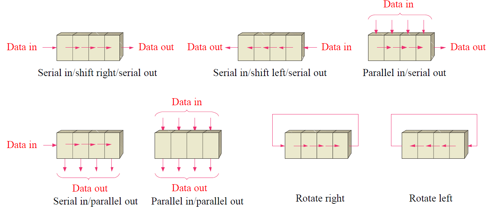

1. **串行输入/右移/串行输出**：
   - 数据从左侧串行输入，通过右移操作，最后从右侧串行输出。
2. **串行输入/左移/串行输出**：
   - 数据从右侧串行输入，通过左移操作，最后从左侧串行输出。
3. **并行输入/串行输出**：
   - 数据同时从顶部并行输入，然后逐一串行输出。
4. **串行输入/并行输出**：
   - 数据从左侧串行输入，通过右移操作，然后同时从各触发器并行输出。
5. **并行输入/并行输出**：
   - 数据同时从顶部并行输入，然后同时从各触发器并行输出。
6. **右旋转**：
   - 数据右移一位，最后一位的数据循环到第一位。
7. **左旋转**：
   - 数据左移一位，第一位的数据循环到最后一位。

- 如果需要节省引脚和硬件资源，**串行输入/串行输出**是较好的选择。
- 如果需要快速读取和写入数据，**并行输入/并行输出**是较好的选择。
- 如果需要在数据处理过程中保留所有位信息，**旋转操作**是较好的选择。

## 串行输入/串行输出（SISO）移位寄存器

- **移位寄存器**：可以通过集成电路（IC）形式或由离散触发器构建，如图中所示的五位串行输入/串行输出移位寄存器。
- **功能**：每个时钟脉冲会将一个输入位移动到下一个触发器。

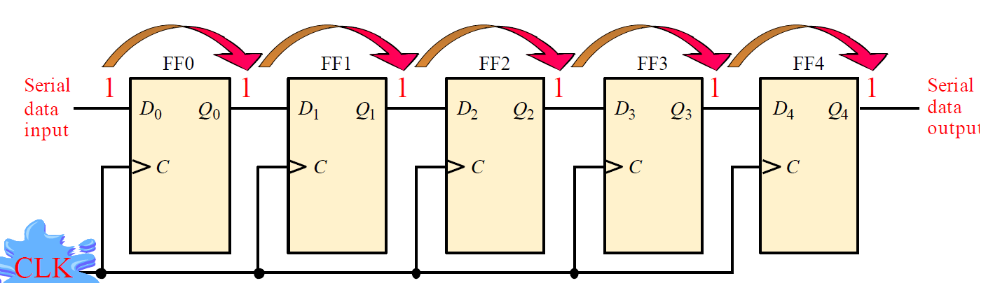

1. **输入数据**：数据以串行形式从左侧输入，每次输入一个位。
2. 触发器（FF0, FF1, FF2, FF3, FF4）：每个触发器保存一个数据位，数据位在时钟脉冲（CLK）的驱动下逐步向右移动。
   - **FF0**：数据输入到第一个触发器 𝐷0*D*0 中。
   - **FF1**：下一个时钟脉冲后，数据位从 𝐷0*D*0 移动到 𝐷1*D*1。
   - 依次类推，数据位依次移动到 𝐷2*D*2、𝐷3*D*3 和 𝐷4*D*4。
3. **输出数据**：数据以串行形式从最右侧输出。

- 图片中演示了一个数据位“1”从输入端移到输出端的过程。
  - 起始时，“1”在 𝐷0*D*0 中。
  - 每个时钟脉冲后，“1”依次移动到 𝐷1*D*1、𝐷2*D*2、𝐷3*D*3 和 𝐷4*D*4。
  - 最终，“1”从 𝐷4*D*4 输出到串行数据输出端。

每次上升沿只能传递一个f。

## 串行数据转换为并行形式

经过四个时钟脉冲后，数据在并行输出端口可用。

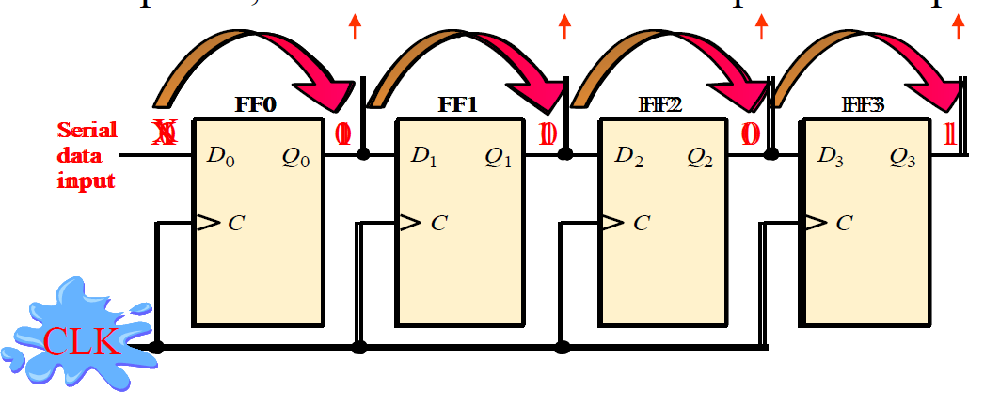

example：1011→$Q_0Q_1Q_2Q_3 = 1011$

### 74HC164A

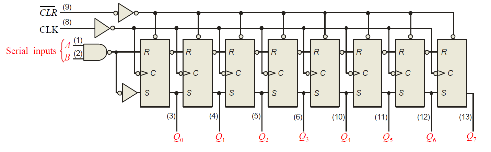

这里的SR跟JK是相反的，Q的输出和S一致

输入用NAND两个inputs其中一个是使能，保证传入的可靠性

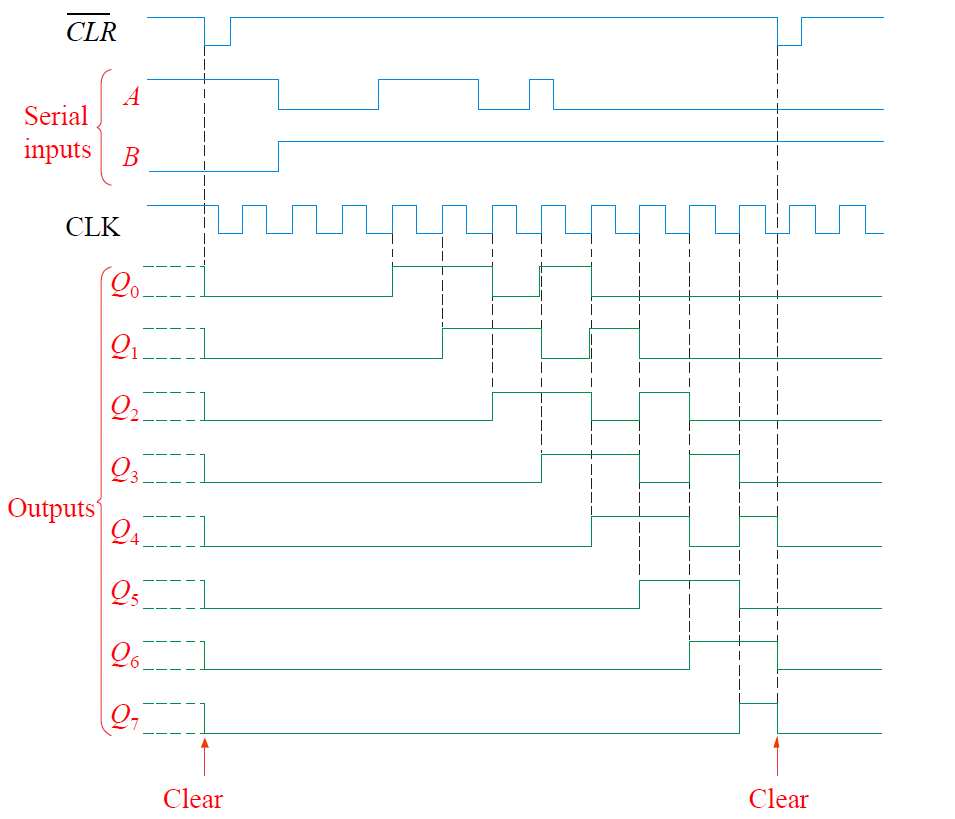

## 并行输入/串行输出Parallel in/Serial out Shift Register

#### 并行加载数据

1. SHIFT/LOAD信号为低电平

   （假设低电平为加载模式）：

   - NAND门 G1, G2, G3, G4 接通，使 D0, D1, D2, D3 直接输入到触发器 FF0, FF1, FF2, FF3 的D端。
   - 时钟脉冲（CLK）到来时，D0, D1, D2, D3 被并行加载到相应的触发器中。
   - 此时，Q0 = D0, Q1 = D1, Q2 = D2, Q3 = D3。

加载部分一个CLK就可以完成

#### 数据移位

1. SHIFT/LOAD信号为高电平

   （假设高电平为移位模式）：

   - NAND门 G5, G6, G7 接通，使触发器的Q输出与下一个触发器的D输入相连。
   - 在时钟脉冲（CLK）的驱动下，数据从一个触发器移位到下一个触发器。
   - 例如，Q0 的数据位移到 Q1, Q1 的数据位移到 Q2, Q2 的数据位移到 Q3，最后 Q3 的数据通过串行数据输出端输出。

#### 74HC165 Shift Register

- **SH/LD**：移位/加载控制引脚。当该引脚为低电平时，允许并行数据加载。当为高电平时，允许移位操作。
- **SER**：串行数据输入引脚。当进行移位操作时，新的数据通过此引脚输入。
- **CLK**：时钟引脚。控制数据加载和移位操作的时钟信号。
- **CLK INH**：时钟禁止引脚。用于控制时钟信号的有效性。
- **Q7** 和 **$\overline{Q7}$**：串行数据输出引脚。移位操作后，数据从Q7串行输出。

## Bidirectional Shift Register双向移位寄存器

通过一个右/左（RIGHT/LEFT）输入来实现数据的双向移位。

- **RIGHT/LEFT 输入**：控制数据移位方向的输入信号。
- **串行数据输入**：数据输入端，用于在移位操作中输入新的数据。
- **逻辑门（G1, G2, G3, G4, G5, G6, G7, G8）**：用于控制数据的传输和移位方向。
- **触发器（D触发器）**：用于存储每个位的数据（Q0, Q1, Q2, Q3）。
- **时钟引脚（CLK）**：控制数据移位的时钟信号。

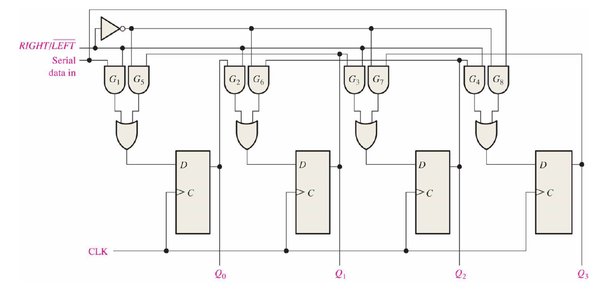

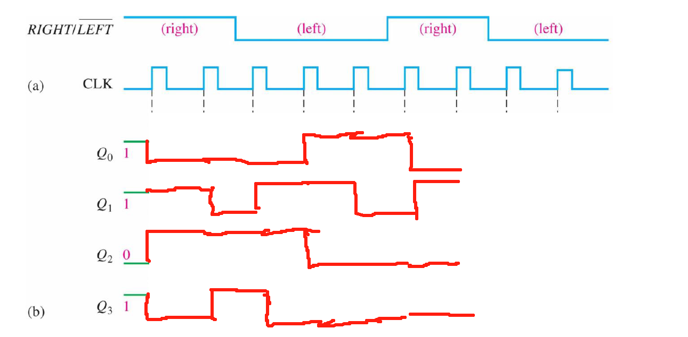

初始SR是1011

右移是从小数位加入新的0，这里的左右不是写出来数值上的左右，而是反转后图形ff的左右

## Universal Shift Register

通用移位寄存器

- **CLR**（1号引脚）：清除引脚，用于异步清除寄存器内容。当CLR为低电平时，寄存器被清除，所有输出Q0-Q3变为0。
- **S0, S1**（9号和10号引脚）：模式选择引脚，用于选择寄存器的操作模式。
- **SR SER**（2号引脚）：右移串行数据输入，用于在右移操作时输入串行数据。这个输入接在Q0左边
- **SL SER**（7号引脚）：左移串行数据输入，用于在左移操作时输入串行数据。这个输入接在$Q_{max}$右边
- **CLK**（11号引脚）：时钟引脚，用于控制数据加载和移位操作的时钟信号。
- **D0-D3**（3号到6号引脚）：并行数据输入引脚，用于加载4位并行数据。
- **Q0-Q3**（15号到12号引脚）：数据输出引脚，用于输出寄存器中的数据。

#### 操作模式

74HC194具有多种操作模式，通过S0和S1引脚选择操作模式：

- **并行加载**（S0 = 1, S1 = 1）：并行数据通过D0-D3引脚加载到寄存器中。
- **保持状态**（S0 = 0, S1 = 0）：保持当前寄存器状态，不进行移位或加载操作。
- **右移**（S0 = 0, S1 = 1）：数据向右移位，从SL SER引脚输入新的数据。
- **左移**（S0 = 1, S1 = 0）：数据向左移位，从SR SER引脚输入新的数据。

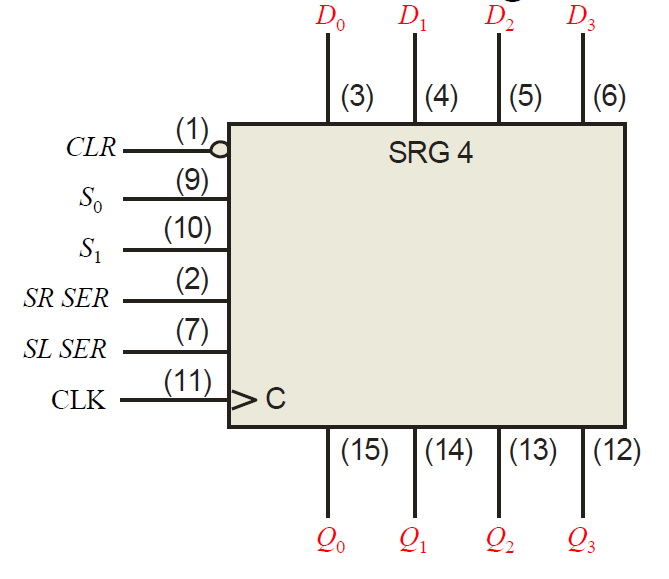

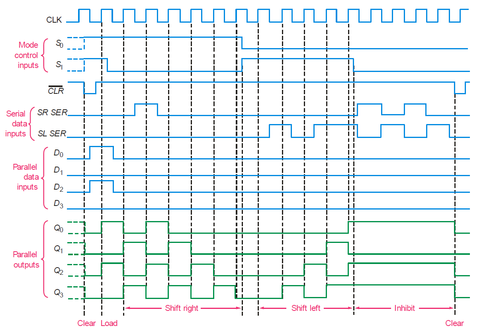

## Shift Register Counters

使用移位寄存器形成计数器的两种重要方法：Johnson 计数器和环形计数器。

### Johnson计数器

Johnson 计数器可以使用一系列D触发器或JK触发器实现。

#### 使用D触发器

1. **结构**：
   - 由多个D触发器串联组成，每个触发器的输出连接到下一个触发器的输入。
   - 最后一个触发器的反向输出（$\overline {𝑄_3}$）反馈到第一个触发器的输入。
2. **工作原理**：
   - 在时钟脉冲的控制下，数据循环移位。
   - 𝑄3‾*Q*3 的反馈确保计数器在0和1之间切换，形成特定的计数模式。
   - Johnson 计数器的特点是输出序列长度为2n（n是触发器的数量）。

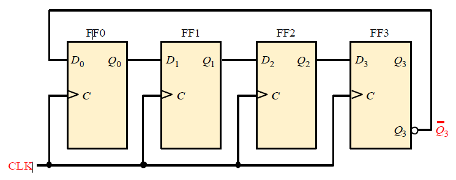

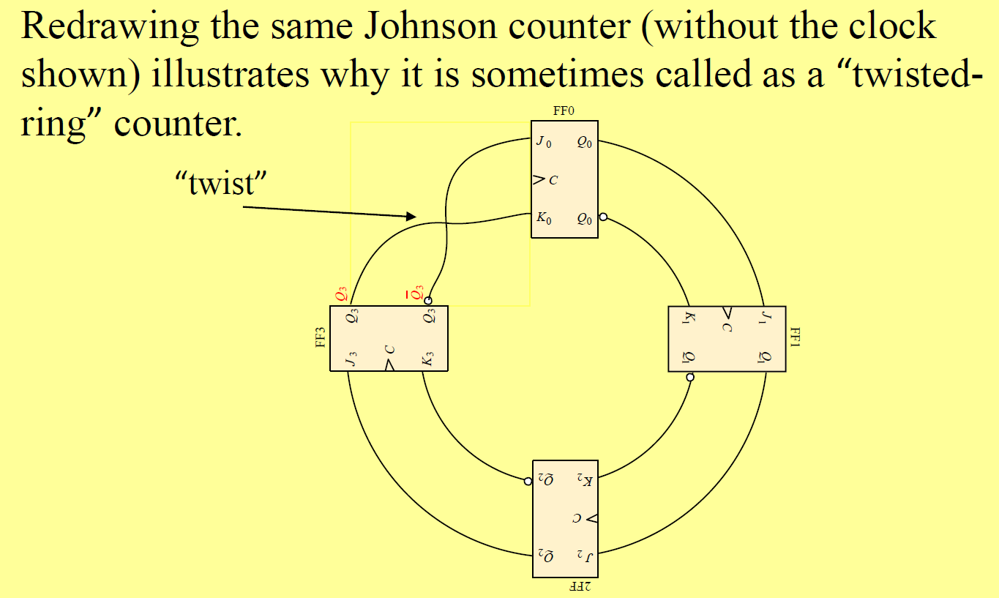

- **Johnson 计数器**：
  - 使用D触发器或JK触发器实现。
  - 通过最后一个触发器的反向输出反馈到第一个触发器形成循环。
  - 输出序列长度为2n。

Johnson 计数器在每个时钟脉冲下通过反向反馈形成一个循环序列，序列长度为 2𝑛（其中 𝑛 是寄存器的阶段数）。对于4位 Johnson 计数器，序列长度为 2×4=8。

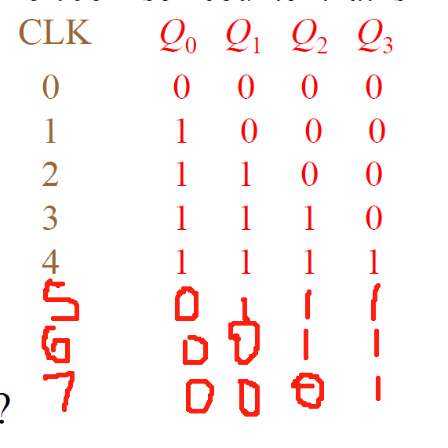

每次最右边的数取反后回到最左边。

### Ring Counter

没有取反

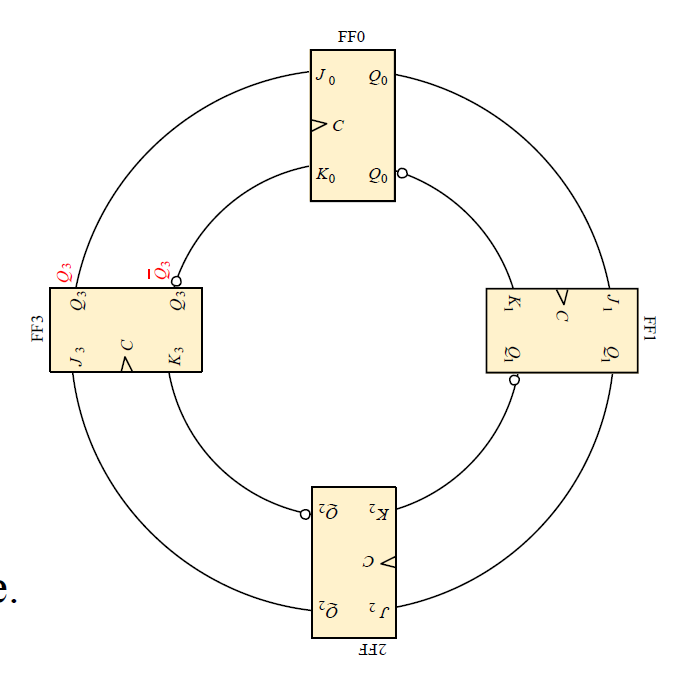

由于没有取反，则需要预加载一个1，其余都是0（常见预加载操作），然后使得每一个CLK时结果都是唯一的。

环形计数器的状态数量比Johnson计数器更少，只有n个状态

### 移位寄存器的应用

An 8-bit serial in/serial out shift register has a **40 MHz clock**. What is the total delay through the register?

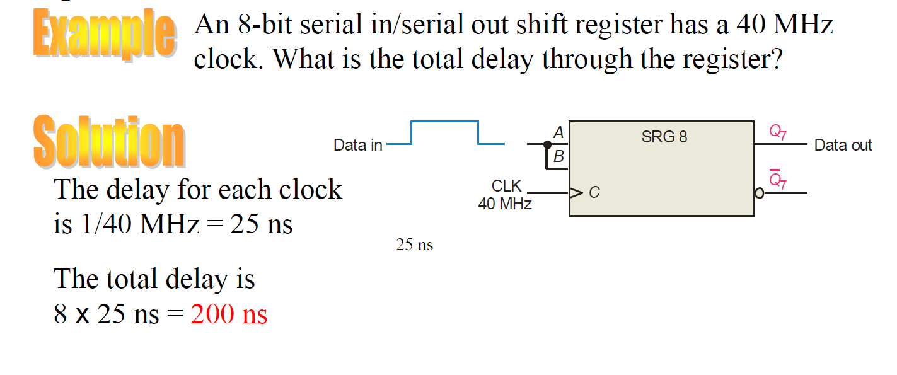

每个CLK才能移动一位，则要经过一共8位才能从输入到输出。

#### UART

UART是一种用于串行通信的设备，能够在串行和并行数据之间进行转换。

- **串行-并行转换器**：将串行数据转换为并行数据。
- **并行-串行转换器**：将并行数据转换为串行数据。

1. **发射器移位寄存器（Transmitter Shift Register）**：
   - 将并行数据转换为串行数据。
   - 并行数据通过数据总线传输到发射器数据寄存器，然后进入发射器移位寄存器。
   - 在时钟脉冲的作用下，数据被逐位移出，通过串行数据输出端发送。
2. **接收器移位寄存器（Receiver Shift Register）**：
   - 将串行数据转换为并行数据。
   - 串行数据通过串行数据输入端进入接收器移位寄存器。
   - 在时钟脉冲的作用下，数据逐位移入并转换为并行数据，通过接收器数据寄存器输出到数据总线。

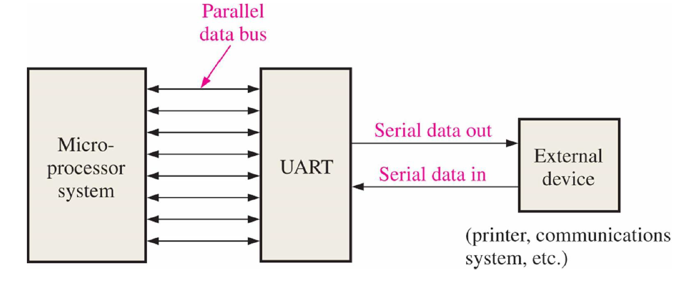

微处理系统只能处理并行数据，但是外部设备传输的都是串行数据，所以需要UART来转换。

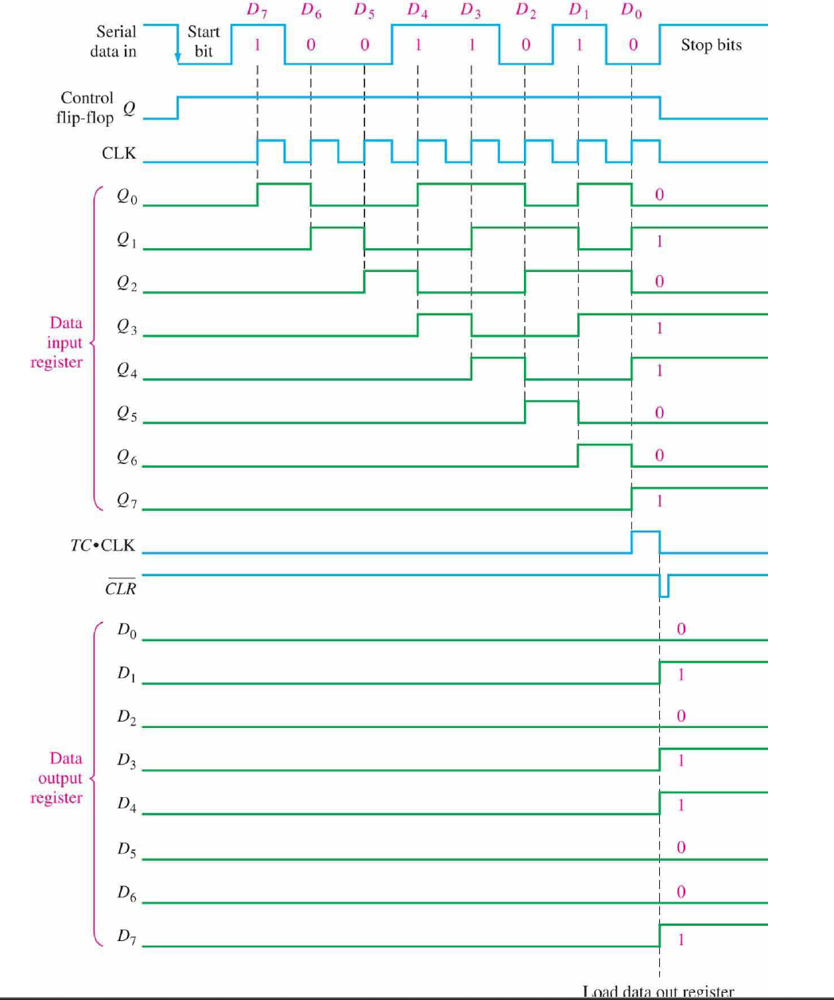