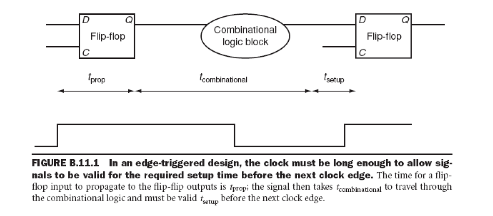
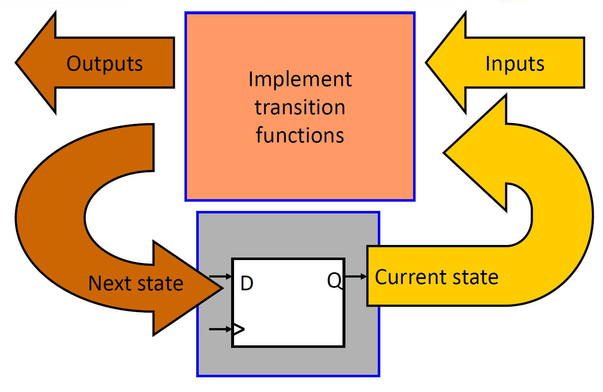

## Combinational and Sequential Circuit

- 数字逻辑系统可以分为组合电路（combinational）和时序电路（sequential）。
  - **组合电路可以完全通过真值表**（truth table）来描述。这意味着组合电路的输出**仅仅取决于当前输入**，不涉及任何历史输入信息。
  - 时序电路则包含存储在系统内部存储器中的状态。它们的行为不仅取决于当前提供的输入集，还取决于内部存储器的内容，或者说系统的状态。因此，时序电路不能通过真值表来描述。相反，时序系统通常被描述为**有限状态机（finite-state machine）**，或者简单地称为状态机（state machine）。

总结来说，组合电路的输出仅依赖当前输入，而时序电路的输出则依赖于当前输入和之前的状态。

- $t_{prop}$: 信号通过触发器传播的时间，有时也称为时钟到Q（clock-to-Q）。
- **$𝑡_{𝑐𝑜𝑚𝑏𝑖𝑛𝑎𝑡𝑖𝑜𝑛𝑎𝑙}$**: 任何组合逻辑块的最长延迟时间（根据定义，该逻辑块被两个触发器包围）。
- $𝑡_{𝑠𝑒𝑡𝑢𝑝}$: 在时钟上升沿之前，输入信号必须有效的时间。

## Finite State Machines

1. **有限状态机的定义：**
   - 有限状态机具有一组状态和两个函数，分别称为下一状态函数（next-state function）和输出函数（output function）。

2. **状态集合：**
   - 状态集合对应于内部存储的所有可能组合。
   - **如果有 \( n \) 位的存储，则可能的状态数量为 \( 2^n \)。**
   
3. **下一状态函数：**
   - 下一状态函数是一个组合逻辑函数，根据输入和当前状态决定系统的下一状态。

总结来说，有限状态机通过定义**一组有限的状态**和**两个主要函数**来描述系统行为，其中状态集合由内部存储的所有可能组合决定，下一状态函数则决定了在给定输入和当前状态下系统的下一状态。这种模型广泛应用于各种数字系统的设计与分析。

1. **输出函数：**
   - 输出函数生成一组输出，这些输出取决于当前状态和输入。

2. **有限状态机的类型：**
   - 有两种类型的有限状态机：Moore 机和 Mealy 机。
     - **Moore 机**：输出仅取决于当前状态。
     - **Mealy 机**：输出取决于当前状态和当前输入。
   - 本课程只涉及 Moore 机。
   - 这两种类型在功能上是等价的。

总结来说，有限状态机可以分为 Moore 机和 Mealy 机，二者的主要区别在于输出的依赖性：Moore 机的输出仅与当前状态有关，而 Mealy 机的输出同时受当前状态和当前输入的影响。虽然它们在功能上等价，但它们在实际应用中的选择可能会根据具体需求有所不同。

